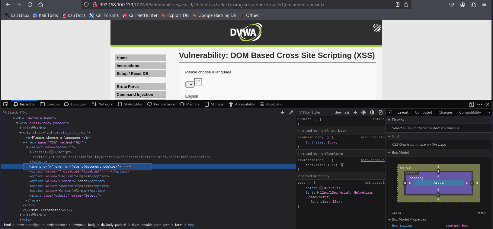

# DOM Based XSS

=> ***DOM là gì?***

- ***DOM (Document Object Model)*** là một giao diện lập trình cho các tài liệu HTML và XML.

- ***Nó làm gì?***: DOM biểu diễn một trang web dưới dạng một cấu trúc dữ liệu, cho phép các chương trình (như JavaScript) thay đổi cấu trúc, nội dung và giao diện của trang web.

- ***Ví dụ***: Một trang web là một tài liệu HTML, và DOM giúp trình duyệt hiểu và hiển thị tài liệu đó. Có thể xem DOM như ***một bản đồ*** của trang web, giúp JavaScript "điều khiển" trang web dễ dàng hơn.


***Khai thác DOM (DOM-Based XSS)***

- ***DOM-Based XSS*** là một loại tấn công mà mã độc JavaScript được thực thi trực tiếp trong trình duyệt mà không cần tải lại trang hoặc gửi dữ liệu đến máy chủ (backend).

- ***Nguyên nhân***: Lỗ hổng xảy ra khi website sử dụng dữ liệu đầu vào từ người dùng (ví dụ: URL, form nhập liệu) mà không kiểm tra hoặc làm sạch dữ liệu đó trước khi đưa vào DOM.

***Ví dụ kịch bản tấn công***

=> Cách hoạt động:

- Website sử dụng JavaScript để lấy nội dung từ tham số ***window.location.hash*** (phần sau dấu ***#*** trong URL).

- Nội dung này được hiển thị trực tiếp lên trang web mà không được kiểm tra xem có chứa mã độc hay không.

- Attacker có thể chèn mã JavaScript độc hại vào phần hash của URL, và mã này sẽ được thực thi khi trang web hiển thị nội dung.

=> Ví dụ:

URL: 

    https://example.com/page#<script>alert('XSS');</script>

Nếu website không kiểm tra nội dung sau dấu #, đoạn mã           
    
    <script>alert('XSS');</script> 

sẽ được thực thi, hiển thị một hộp thông báo "XSS".

=> Cách kiểm tra ***DOM-based XSS***:

DOM-Based XSS khó kiểm tra vì nó xảy ra hoàn toàn trên trình duyệt. Cách tìm lỗ hổng:

- Tìm các biến mà kẻ tấn công có thể kiểm soát (ví dụ: ***window.location.x***).

- Kiểm tra cách dữ liệu được xử lý: có ghi vào DOM hoặc sử dụng các hàm không an toàn như ***eval()*** không.

# Lab: Khai thác lỗi Dom Based XSS trên DVWA

1. Mức độ *Low-level-security*

   

   Ta thấy rằng giao diện trang web ở mức độ này là 1 page select options
   
   

   Kiểm tra mã nguồn của page thì thấy có 1 đoạn mã tồn tại lỗ hổng nghiêm trọng đó là sử dụng `document.write()` với dữ liệu từ URL. `document.write()` sẽ ghi trực tiếp vào HTML, và trình duyệt sẽ render và  thực thi bất kỳ đoạn mã JS nào được chèn vào.

   Trên URL, ta viết đoạn mã JS lấy cookie hiện tại sau phần `default=`:

   ```js
   <script>alert(document.cookie)</script>
   ```

   

   

   > Kết quả là đoạn mã đã được thực thi và hiển thị ra cookie người dùng

2. Mức độ *Medium-level-security*

   Ở mức độ này ta kiểm tra mã nguồn của page và thấy vẫn tồn tại lỗ hổng giống mức độ Low-level-security đó là ở `document.write()`.

   Ta thử đoạn mã JS giống ở mức độ Low-level-security và nhận thấy không thể khai thác được, sau nhiều lần thử bằng thẻ `<script>` thì thấy biến `default` trên URL luôn nhận giá trị **English** (có thể lập trình viên đã thiết lập kiểm tra giá trị đầu vào và lọc ra thẻ `<script>`). Vậy ta thử dùng các thẻ khác ngoài `<script>` thì sao ???

   Ta thử đoạn mã sau
   ```js
   
   ```
   

   Có một vấn đề xảy ra là thẻ `` nó nằm bên trong thẻ `<option>`. Các thẻ `<svg onload=...>` hoặc `` phụ thuộc vào việc được render đúng trong DOM. Nhưng nếu đặt chúng bên trong `<option>`, thì trình duyệt không render nội dung HTML bên trong `<option>` các sự kiện như *onload*, *onerror* không được kích hoạt, không giống như thẻ `<script>` luôn được thực thi ngay nếu không bị lọc. Dẫn đến kết quả là không có gì được xảy ra, để ý thì thấy toàn bộ `<option>` được bọc trong thẻ `<select>` nên trước khi đưa vào biến *default*
   thì ta sẽ thêm `</select>` đằng trước đoạn mã khai thác nhằm đóng thẻ `<select>` hiện tại lại và dể cho `<svg>` hoạt động độc lập bên ngoài để browers hiểu và thực thi được. Đoạn mã mới có dạng như sau:
   ```js
   </select>
   ```
   

   

   > Kết quả là ta đã lấy được thông tin cookie của người dùng.

3. Mức độ *High-level-security*

   Ở mức độ này lập trình viên đã lọc dữ liệu đầu vào khá chặt chẽ chỉ nhận vào các giá trị cụ thể, nếu không thì chả về *default* = *English*, chi tiết có thể xem trong view source chứa mã nguồn của page

   

   Sử dụng kỹ thuật thêm dấu `#` vào sau giá trị hợp lệ và trước mã JS ta cần chèn. PHP sẽ chỉ thấy phần kết quả đầu vào của biến *default* = giá trị hợp lệ (phần trước dấu `#`), vì nội dung sau dấu # là fragment (hash) không được gửi lên server

   ```js
   #<script>alert(document.cookie)</script>
   ```
   

   
   > Kết quả là ta vẫn thu thập được thông tin cookie người dùng
   
   


