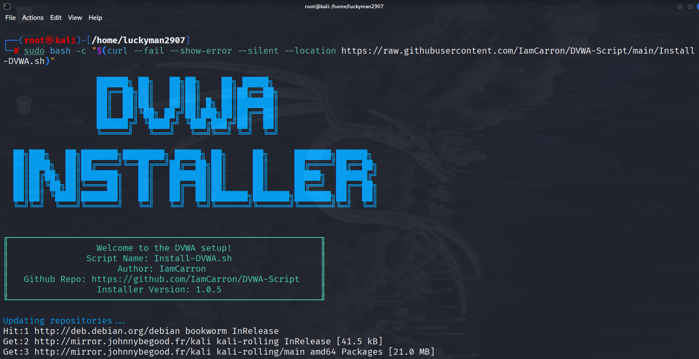
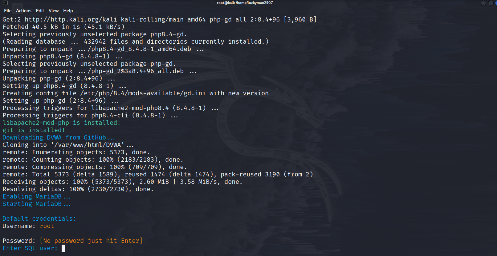
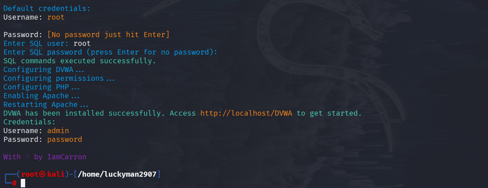
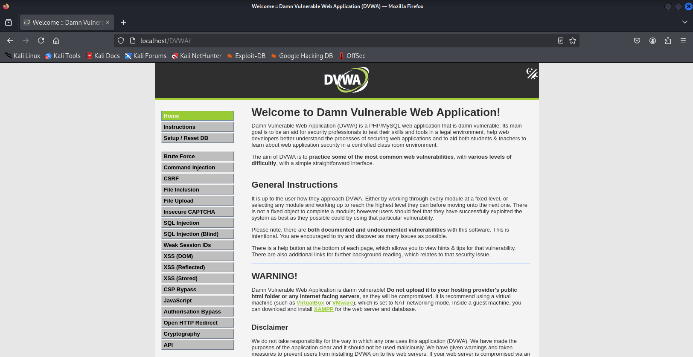

# DAMN VULNERABLE WEB APPLICATION - ỨNG DỤNG WEB DỄ BỊ TẤN CÔNG

Damn Vulnerable Web Application (DVWA) là một ứng dụng web PHP/MySQL cực kỳ dễ bị tấn công. Mục tiêu chính của ứng dụng này là hỗ trợ các chuyên gia bảo mật kiểm tra kỹ năng và công cụ của họ trong môi trường pháp lý, giúp các web dev hiểu rõ hơn về quy trình bảo mật ứng dụng web và hỗ trợ cả học sinh/sinh viên và giáo viên tìm hiểu về bảo mật ứng dụng web trong một môi trường được kiểm soát.

Mục đích của DVWA là **thực hành với một số lỗ hổng web phổ biến nhất**, với **mức độ khó khác nhau** và giao diện đơn giản, dễ hiểu.
Xin lưu ý, có **cả lỗ hổng được ghi lại và không** với phần mềm này. Đây là có chủ đích. Bạn nên thử và khám phá càng nhiều vấn đề càng tốt.

- - -

## Cảnh báo!

Damn Vulnerable Web Application dễ bị tấn công! **Không tải nó lên folder public của nhà cung cấp dịch vụ lưu trữ của bạn hoặc bất kỳ máy chủ nào có kết nối Internet**, vì chúng sẽ bị xâm phạm. Bạn nên sử dụng máy ảo (vd như [VirtualBox](https://www.virtualbox.org/) hoặc [VMware](https://www.vmware.com/)), để sử dụng chế độ NAT networking. Trên máy khác, bạn tải và cài đặt [XAMPP](https://www.apachefriends.org/) cho web server và database.

- - -

## Download

Mặc dù có nhiều phiên bản DVWA khác nhau nhưng phiên bản được hỗ trợ duy nhất là từ repo GitHub chính thức này. Bạn có thể clone nó từ repo:

```
git clone https://github.com/digininja/DVWA.git
```

Clone về máy Kali Linux:


Hoặc [tải file zip](https://github.com/digininja/DVWA/archive/master.zip).

- - -

## Cài đặt

### Cài đặt tự động 🛠️

**Lưu ý, đây không phải là script chính thức của DVWA, nó được viết bởi [IamCarron](https://github.com/iamCarron/). Rất nhiều nỗ lực đã được thực hiện để tạo script và khi nó được tạo, nó không làm bất cứ điều gì độc hại, tuy nhiên, để đề phòng, bạn nên xem lại script trước khi chạy nó một cách mù quáng trên hệ thống của mình. Vui lòng báo cáo bất kỳ lỗi nào cho [IamCarron](https://github.com/iamCarron/), chứ không phải reong repo này.**

Script cấu hình tự động cho DVWA trên các máy dựa trên Debian, bao gồm Kali, Ubuntu, Kubuntu, Linux Mint, Zorin OS...

**Lưu ý: Script này yêu cầu quyền root và được điều chỉnh cho các distro dựa trên Debian. Đảm bảo bạn đang chạy nó với quyền root user.**

#### Yêu cầu cài đặt

- **Hệ điều hành:** Distro trên Debian (Kali, Ubuntu, Kubuntu, Linux Mint, Zorin OS).
- **Đặc quyền:** Sử dụng root user.

#### Các bước cài đặt

##### Bằng một lệnh duy nhất (One-liner)

Lệnh này sẽ tải script cài đặt được viết bởi [@IamCarron](https://github.com/IamCarron) xuống và tự động chạy script đó. Điều này sẽ không được đưa vào đây nếu chúng tôi không tin cậy tác giả và kịch bản như khi chúng tôi xem xét nó, nhưng luôn có khả năng ai đó sẽ lừa đảo và vì vậy nếu bạn không cảm thấy an toàn khi chạy code của người khác mà không kiểm tra trước, hãy làm theo quy trình thủ công và bạn có thể xem lại sau khi tải xuống.

```bash
sudo bash -c "$(curl --fail --show-error --silent --location https://raw.githubusercontent.com/IamCarron/DVWA-Script/main/Install-DVWA.sh)"
```
Sau khi đã clone về máy rồi thì cài đặt theo script bên trên bằng quyền root:



Sau khi script trên chạy xong thì sẽ mở ra MariaDB, yêu cầu tạo **User SQL** (để mặc định là ***root***):



Sau khi đã nhập xong User và Password thì nó sẽ config và thông báo cài thành công DVWA.



Mở Firefox trên Kali Linux truy cập vào địa chỉ http://localhost/DVWA, tại đây có thể thực hiện các bài lab của DVWA:



