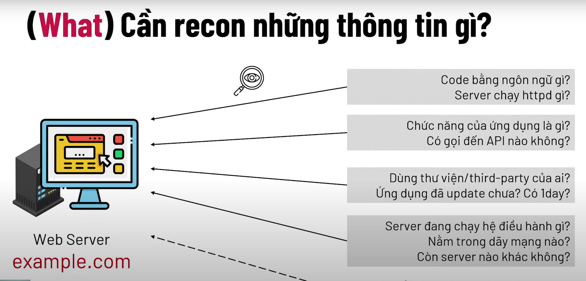
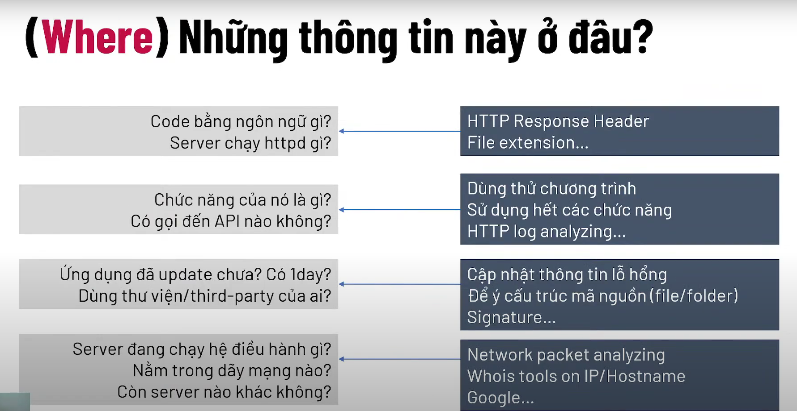
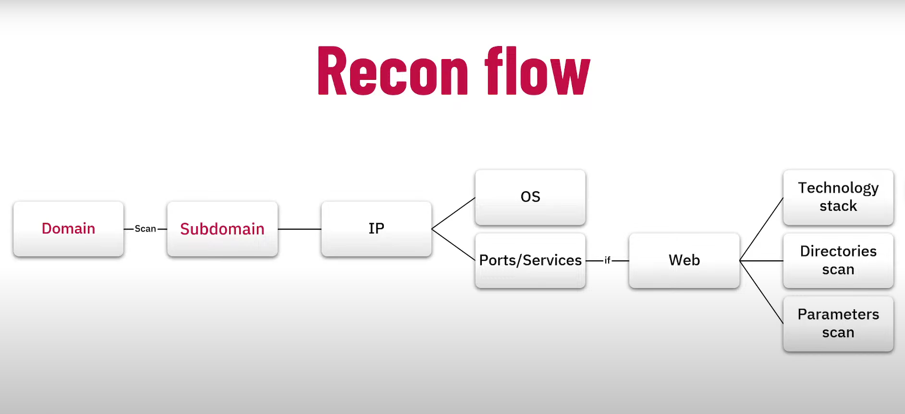

# **Reconnaissance**

**Reconnaissance** (gọi tắt *Recon*) là một quy trình kỹ thuật do thám phổ biến và gần như là tiền đề của bất kỳ dự án **Pentest** nào.

- Thu thập thông tin về target nhiều nhất có thể để lên kế hoạch tấn công.
  - Domain / Subdomains
  - IP / Range IP / Ports
  - Directory Path
  - Network architecture / topology
  - Operating Systems
  - User's roles
  - Hardware
  - Passwords/credentials (leaked)
  - Source code (leaked)
  - ...
- Để tìm được:
  - (**What**) Cần tìm gì?
  
    
   
  - (**Where**)Tìm ở đâu?
  
    

  - (**How**)Tìm như thế nào?
  
    

- Lợi ích Recon:
  - Tiết kiệm thời gian
  - Xác định được cửa ngõ *untrusted data*
  - Thấy được sự liên kết của các surface
  - Có thêm thông tin, bàn đạp để nâng cao impact
  - Vạch ra phương án tấn công hoàn hảo, sắc sảo
