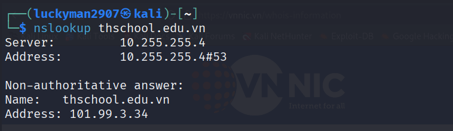
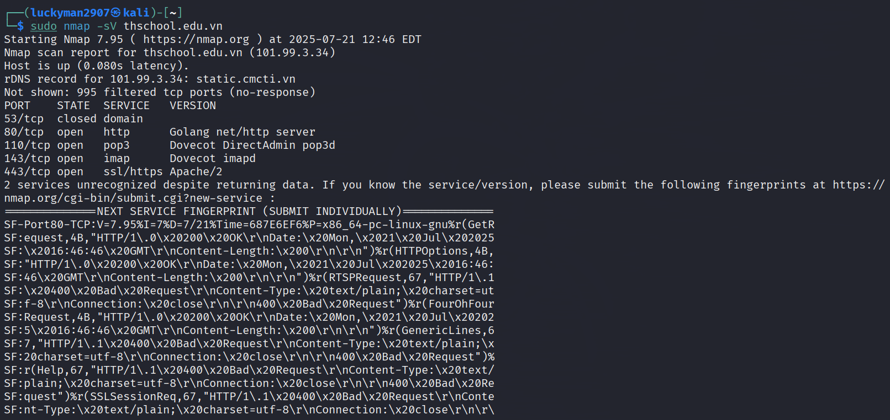
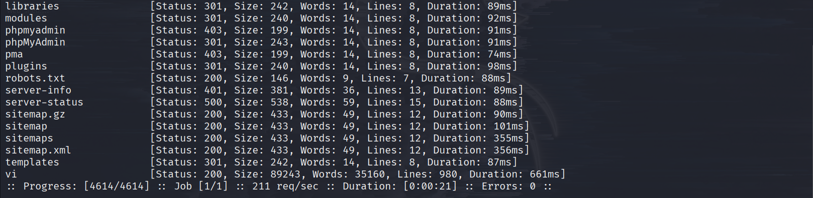

# RECONNAISSANCE TARGET TRANG WEB TH SCHOOL

## 1. Thu thập Domain, Subdomains

- Tên miền và thông tin đăng ký:
  - Kiểm tra thông tin WHOIS để biết chủ sở hữu tên miền, ngày đăng ký, hết hạn, và máy chủ DNS.
  - Công cụ:
    - WHOIS Lookup (whois.domaintools.com, whois.icann.org)
    - DomainTools
    - ICANN Lookup
  - Ở đây, tôi sử dụng [DomainTools](https://whois.domaintools.com) để tra cứu Whois của tên miền:

  

  

  - Kết quả: Thông tin về tổ chức/đơn vị sở hữu, email liên hệ, nhà cung cấp dịch vụ hosting.
- Tìm kiếm subdomain:
  - Xác định các tên miền phụ (subdomain) liên quan đến trang web chính: ***thschool.edu.vn***
  - Công cụ:
    - Subfinder
    - Amass
    - Sublist3r
    - Censys
    - Shodan
  - Ở đây, tôi sẽ sử dụng [Amass](https://github.com/OWASP/Amass) để dò quét các subdomains. Do **Amass** dùng 5 Technique và mỗi Technique lại gồm nhiều nguồn nên khi chạy sẽ hơi lâu một chút.
    
    

    ```bash
    amass enum -passive -d <hostname>
    ```
    
    

  - Kết quả: Danh sách các subdomain mà amass scan được.

## 2. Xác định IP 
- Sau khi đã xác định được domain, subdomains rồi thì với mỗi 1 subdomain ta sẽ thu thập được các bản ghi DNS như A, MX, TXT, CNAME để hiểu về hạ tầng mạng.
- Công cụ:
  - Dig (Linux/Unix)
  - Nslookup
  - DNSdumpster
  - MXToolbox
- Ở đây, tôi sẽ dùng ***Nslookup*** để tra cứu thông tin DNS của tên miền thschool.edu.vn

  - Thực hiện tra cứu IP của tên miền thschool.edu.vn:

    ```bash
    nslookup thschool.edu.vn
    ```

    

    &rarr;  101.99.3.34	 Đây là địa chỉ IPv4 thực tế (A record) mà tên miền thschool.edu.vn trỏ tới. Đây là IP máy chủ chứa trang web.
  - Tra cứu bản ghi MX (Mail Server):

    ```bash
    nslookup -type=mx thschool.edu.vn
    ```

    

    &rarr; Danh sách các mail server xử lý email cho tên miền.
  - Tra cứu bản ghi NS (Name Server):

    ```bash
    nslookup -type=ns thschool.edu.vn
    ```

    

    &rarr; Danh sách các máy chủ DNS chính thức (NS record) của tên miền thschool.edu.vn.

## 3. Scan Port & Services

- Công cụ: 
  - nmap
  - rustscan
  - metabigor
- Ở đây, tôi quen sử dụng **Nmap** - công cụ được phát triển bởi hacker người Nga [Gordon Lyon](https://nmap.org). Các options thường dùng:
  - Scan speed: `-T0 -T1 -T2 -T3 -T4 -T5`
  - Port range: `-p1-65535`
  - Service version detection: `-sV`
  - OS detection: `-O`
  - Service version detection, OS detection, script scanning and traceroute: `-A` (aggressive)
  
- Quét các cổng đang mở trên tên miền thschool.edu.vn:

  ```bash
  nmap thschool.edu.vn
  ```

  

  &rarr; Kết quả cho thấy chỉ có hai cổng đang mở public là 80 (http) và 443 (https)

- Quét dịch vụ trên các cổng đang mở:

  ```bash
  nmap -sV thschool.edu.vn
  ```

  
  
  &rarr; Kết quả cho thấy trên cổng 80 sử dụng Golang server, còn cổng 443 có SSL sử dụng Apache/2 (máy chủ web đang chạy Apache)

## 4. Phân tích dịch vụ web

Do các port đang mở đều chạy dịch vụ web nên ta sẽ đi sâu vào scan theo 3 hướng nữa là:

1. Technology stack
   
   Ta sử dụng **Wappalyzer** để xác định các công nghệ được sử dụng trên trang web chính:

   

   Thử với các subdomain khác vừa dò được ở bên trên

   

   

2. Directories scan
  
   - Endpoints là các paths, các file
   - Có 3 cách tìm endpoints
     - Manual
     - Find: Tìm trong source của website: html, javascript
     - Discovery: Brute force path
   - Công cụ:
     - gobuster
     - ffuf
   - Ở đây, tôi sử dụng ***ffuf*** để Brute force path
     
     ```bash
     ffuf -u https://thschool.edu.vn/FUZZ -w /usr/share/wordlists/dirb/common.txt -t 50
     ```

     
     
     
     
     &rarr; Kết quả có thể thấy một số file nhạy cảm như: `.htaccess`, `.hta`, `.htpasswd` bị chặn truy cập (403), tuy nhiên có thể thấy một số đường dẫn thư mục tiềm năng có thể khai thác được như: /admin, /info.php, /index.php, /robots.txt, ...

3. Parameters scan 

   Nếu như bỏ sót parameters thì đồng nghĩa với việc chúng ta đang bỏ sót *unstrusted data*. Vì vậy, ta phải moi được hết các parameters ẩn

   Ta sử dụng **Arjun** (một công cụ mã nguồn mở bằng ngôn ngữ Python, dùng để tự động tìm ra các tham số (parameter) ẩn mà các ứng dụng web có thể xử lý, hay là tìm tham số HTTP GET/POST tiềm ẩn).
  
   ```bash
   arjun -u <target_url>
   ```

   - Scan với URL chính: https://thschool.edu.vn

     

     → Đã phát hiện 13 tham số có thể sử dụng trong tấn công khai thác lỗ hổng, tuy nhiên không thể tìm thấy tham số ẩn nào nữa nếu tiếp tục quét.

   - Thử với các subdomains và endpoints vừa dò được ở phía trên
  
     - https://thschool.edu.vn/admin/login.php

       

     - https://hoalac.thschool.edu.vn

       

       → Có thể thấy một số các parameter chứa `based on: http code`, tức là tham số làm thay đổi mã phản hồi HTTP. Ngoài ra còn có `based on: param name reflection` có ý nghĩa là tham số được phản chiếu lại (reflected) trong nội dung HTML (có khả năng bị XSS).

     - https://chuaboc.thschool.edu.vn

       
       
       → Kết quả tương tự như https://hoalac.thschool.edu.vn
   
  


  


